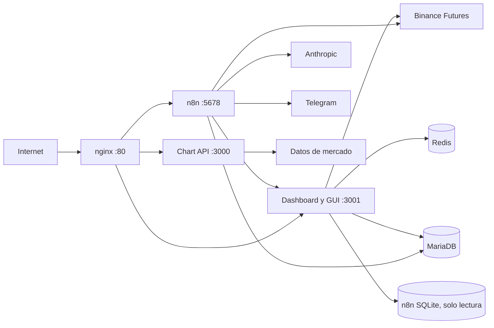
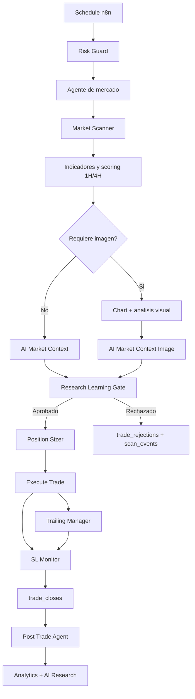

# Arquitectura del bot

## Servicios

## Flujo de trading

## Responsabilidades

| Componente | Responsabilidad | Persistencia |
|---|---|---|
| n8n | Orquestacion, señales, ordenes, SL, trailing y reportes | SQLite n8n + MySQL via API |
| Dashboard API | Contratos `/api`, `/db`, learning, research y estado live | MariaDB + Redis |
| GUI | Trading, Analytics, Simulator, Intelligence y Research | Sin estado autoritativo |
| MariaDB | Trades, cierres, telemetria, research y learning | Volumen `mysql_data` |
| Redis | Estado/cache efimero | Volumen `redis_data` |
| nginx | Entrada publica y reverse proxy | Configuracion versionada |

## Contratos de red

| Ruta publica | Destino |
|---|---|
| `/` y `/api` | Dashboard/GUI `:3001` |
| `/chart` | Chart API `:3000` |
| `/n8n/`, `/rest/`, `/webhook/` | n8n `:5678` |
| `/ws` | WebSocket del dashboard |

Los workflows historicos usan `127.0.0.1`. Por compatibilidad, Dashboard, Chart API y n8n comparten namespace de red en Compose.
