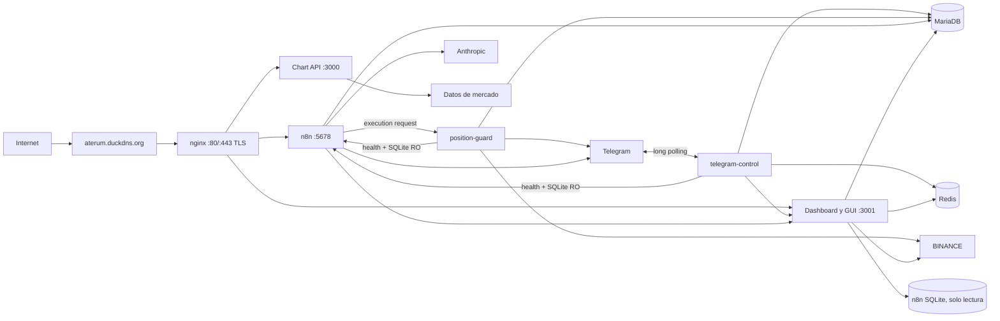
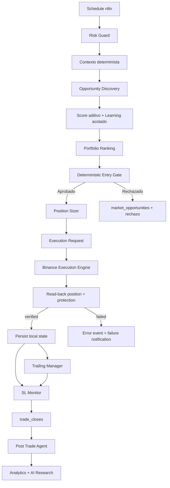

# Arquitectura del bot

## Servicios

Telegram Control incorpora un router local-first: comandos sobre APIs existentes, conocimiento local para FAQs y Claude sólo para razonamiento con contexto compacto. `telegram_ai_usage` y `telegram_ai_cache` auditan coste, latencia y reutilización sin participar en decisiones de trading.

## Flujo de trading

## Responsabilidades

| Componente | Responsabilidad | Persistencia |
|---|---|---|
| n8n | Orquestación, cálculo de riesgo/trailing y solicitudes de ejecución; no muta órdenes Binance | SQLite n8n + MySQL via API |
| Dashboard API | Contratos `/api`, `/db`, learning, research y estado live | MariaDB + Redis |
| Position Guard / Execution Engine | Único escritor Binance, verificación read-back y sincronización Binance → local | MariaDB + Binance |
| GUI | Trading, Analytics, Simulator, Intelligence y Research | Sin estado autoritativo |
| MariaDB | Trades, cierres, telemetria, research y learning | Volumen `mysql_data` |
| Redis | Estado/cache efimero | Volumen `redis_data` |
| nginx | Entrada publica y reverse proxy | Configuracion versionada |
| telegram-control | Centro de operaciones multiusuario con RBAC | `telegram_users`, `telegram_audit` |

## Contratos de red

| Ruta publica | Destino |
|---|---|
| `/` y `/api` | Dashboard/GUI `:3001` |
| `/chart` | Chart API `:3000` |
| `/n8n/`, `/rest/`, `/webhook/` | n8n `:5678` |
| `/ws` | WebSocket del dashboard |

La entrada canonica es `https://aterum.duckdns.org`; HTTP solo atiende ACME y redirige. Los puertos `3000`, `3001` y `5678` estan ligados a `127.0.0.1` y no permiten bypass publico de nginx.

La arquitectura TLS detallada se encuentra en [`../infra/architecture.md`](../infra/architecture.md).

Los workflows historicos usan `127.0.0.1`. Por compatibilidad, Dashboard, Chart API y n8n comparten namespace de red en Compose.

La separacion detallada de responsabilidades de ordenes se documenta en [`../../docs/architecture/order-responsibility-audit.md`](../../docs/architecture/order-responsibility-audit.md).
