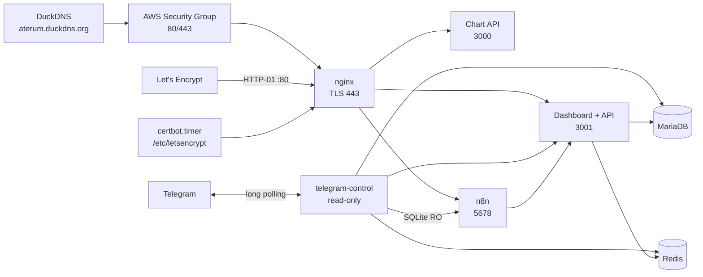
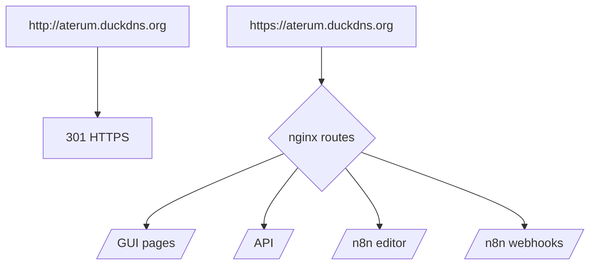

# Arquitectura HTTPS

El dominio se inyecta con `APP_DOMAIN`. Los contratos internos permanecen en HTTP local y no salen del host/namespace Docker.

Telegram Control no está publicado por nginx. Sus roles viewer/moderator/admin sólo habilitan consultas y operaciones analíticas; no existen acciones de trading.
