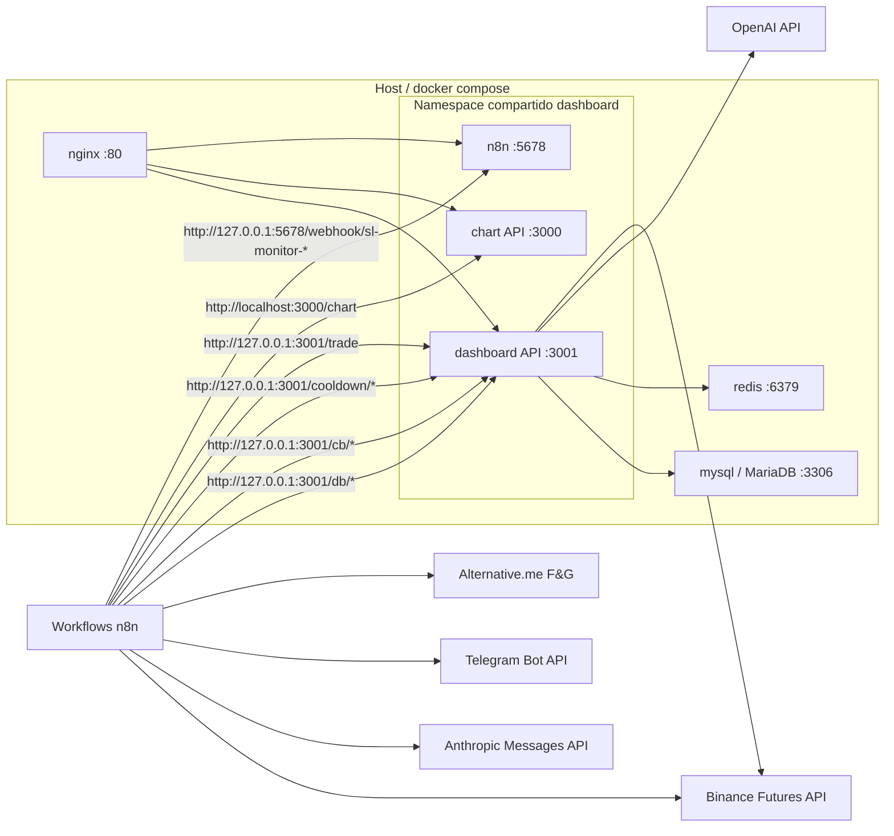
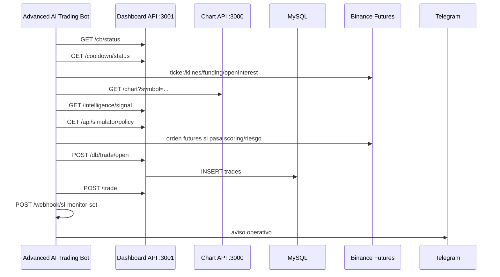
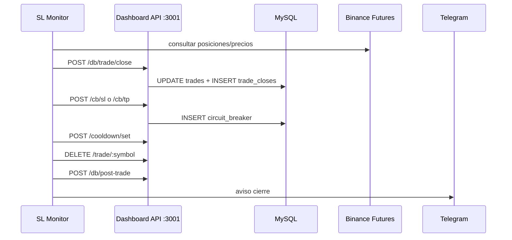
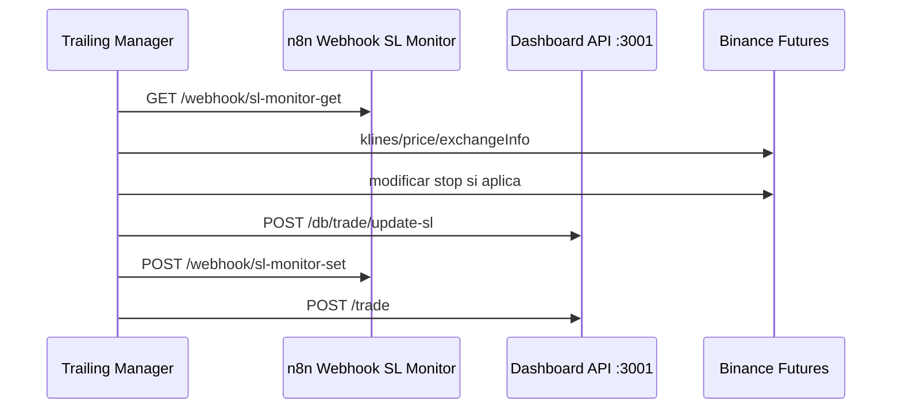

# Arquitectura reconstruida

La arquitectura final preserva los contratos historicos que aparecen en los workflows: n8n espera hablar con el backend en `http://127.0.0.1:3001`, con la chart API en `http://localhost:3000` y consigo mismo en `http://127.0.0.1:5678/webhook/...`.

Para mantener esa compatibilidad sin reescribir workflows, los servicios `dashboard`, `aterum_gui` y `n8n` comparten namespace de red mediante `network_mode: "service:dashboard"`.

## Servicios Docker

| Servicio | Imagen/build | Puerto host | Puerto interno | Rol |
| --- | --- | --- | --- | --- |
| `mysql` | `mariadb:11.4` | no expuesto | `3306` | Persistencia relacional: trades, cierres, scans, rechazos, circuit breaker, post-trade. |
| `redis` | `redis:7-alpine` | no expuesto | `6379` | Servicio esperado de infraestructura. Reservado para estado/caches/colas si se activa en n8n o backend. |
| `dashboard` | build `./aterum_gui` | `3001`, `3000`, `5678` | `3001` | API dashboard, endpoints `/db/*`, `/cb/*`, `/cooldown/*`, `/trade/*`, inteligencia. |
| `aterum_gui` | misma imagen que dashboard | comparte red con `dashboard` | `3000` | Chart API `/chart` y healthcheck. |
| `n8n` | `n8nio/n8n` | comparte puerto `5678` via dashboard | `5678` | Ejecucion/importacion de workflows. |
| `nginx` | `nginx:1.27-alpine` | `80` | `80` | Reverse proxy hacia dashboard, chart API y n8n. |

## Diagrama de componentes

## Flujo de apertura de trade

## Flujo SL Monitor / cierre

## Flujo Trailing Manager

## Contratos internos clave

- n8n espera `127.0.0.1:3001`; por eso no se reemplazo por nombre DNS Docker.
- Chart API espera `localhost:3000`; se conserva dentro del namespace compartido.
- Webhooks SL usan `127.0.0.1:5678/webhook/sl-monitor-*`.
- MySQL no se expone al host por defecto; solo lo consume el backend.
- nginx permite acceso unificado desde el host en `http://127.0.0.1/`.
