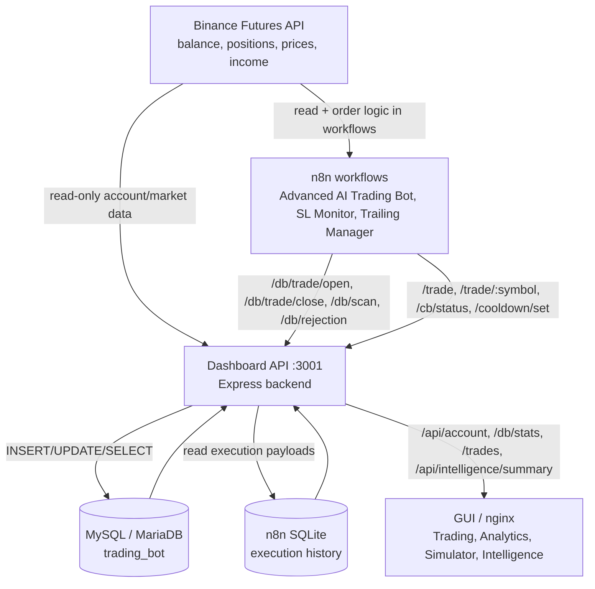

# Data Flow

Fecha: 2026-06-22 05:40 UTC

## Mapa principal

## Fuentes por capa

| Capa | Datos que produce/consume | Estado actual |
| --- | --- | --- |
| Binance | Balance, equity, margen, PnL flotante, posiciones abiertas, precios, klines | Operativo. `/api/account` devuelve datos reales: balance `208.95074855`, 3 posiciones abiertas. |
| n8n | Señales, aperturas, cierres, SL updates, cooldown/circuit breaker, Telegram | Operativo para datos históricos. Simulator lee 12 señales desde la DB de n8n. |
| Dashboard API | Agrega Binance + MySQL + n8n SQLite y expone API a la GUI | Corregido. Ya no devuelve cuenta en cero por credenciales placeholder. |
| MySQL | Trades, cierres, estadísticas, circuit breaker, usuarios, inteligencia histórica | Operativo. 6 trades, 3 abiertos, 3 cerrados, PnL cerrado total `1.82`. |
| GUI | Renderiza Trading, Analytics, Simulator, Intelligence | Operativa. Los widgets principales reciben datos reales desde backend. |

## Hallazgos

1. La GUI no estaba vacía por un problema visual.
2. El backend estaba iniciando con `BINANCE_API_KEY=change_me` y `BINANCE_API_SECRET=change_me`, que anulaban las credenciales históricas de fallback del código.
3. `/api/account` devolvía balance, equity y posiciones en cero porque Binance rechazaba el listen key.
4. `/trades` perdía cierres tras reinicio porque `/data/trades.json` sólo conserva operaciones abiertas; MySQL sí tenía los cierres.

## Correcciones aplicadas

1. `/home/aterum_gui/shared.js`: se agregó `envOrFallback()` para ignorar variables vacías o `change_me` y usar la credencial histórica compatible del sistema.
2. `/home/aterum_gui/routes/trades.js`: `GET /trades` ahora combina:
   - operaciones abiertas desde estado vivo/archivo/Binance;
   - operaciones cerradas desde MySQL (`trades` + `trade_closes`) cuando no están en memoria.
3. Parche aplicado en caliente al contenedor `home-dashboard-1`, reiniciado y confirmado saludable.
4. Imagen local persistida con `docker commit home-dashboard-1 aterum-dashboard:local`.

No se ejecutaron órdenes reales de Binance.
