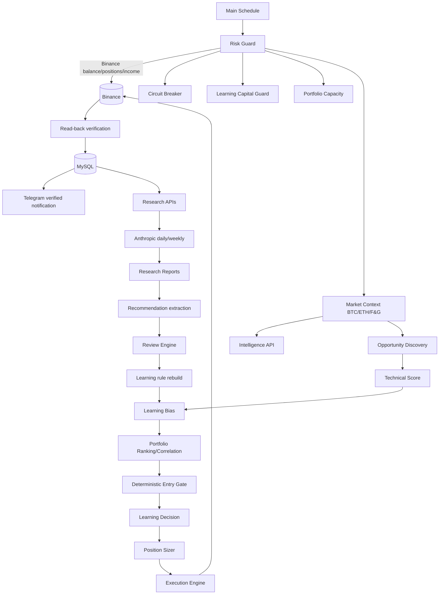
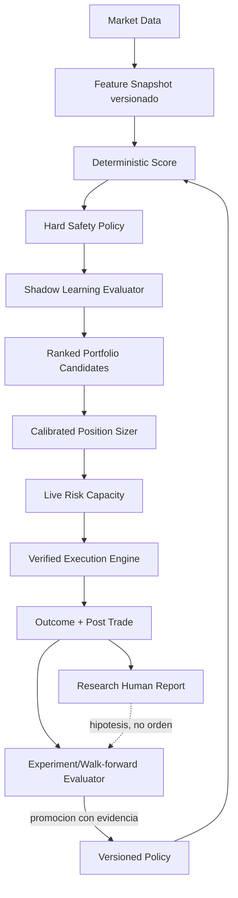

# Auditoria del sistema de decision

Fecha de corte: 2026-07-02 06:21 UTC.

Esta auditoria es descriptiva. No se modificaron codigo, workflows, configuracion, reglas, datos ni limites de riesgo.

## Resumen ejecutivo

El sistema actual no es un conjunto de filtros aislados. Es un pipeline determinista con cuatro capas distintas:

1. `Risk Guard` decide si el portafolio puede buscar una entrada.
2. `Opportunity Discovery` calcula score tecnico, aplica contexto macro, Intelligence, Learning y ranking.
3. `Deterministic Entry Gate` vuelve a evaluar Learning sobre el candidato seleccionado.
4. `Position Sizer` asigna riesgo y el Execution Engine verifica la apertura en Binance.

La ejecucion y el riesgo vivo son las partes mas solidas. Binance es fuente de verdad, la capacidad se calcula con posiciones y STOP reales, y una posicion cuyo STOP ya supera Break Even aporta riesgo abierto cero.

El principal problema no es falta de componentes, sino falta de validacion causal. Research genera muchas hipotesis, Learning las convierte en reglas usando la misma muestra historica y aplica reglas antes de demostrar fuera de muestra que mejoran el resultado. La evidencia mas clara es la regla `score_band 80-89`: con 21 cierres historicos se convirtio en bloqueo absoluto. Desde el despliegue actual bloqueo 63 de 63 candidatos con score tecnico 80-89, mientras permitio operar candidatos 70-79 y 90+. Esto rompe la monotonicidad del score.

No existe evidencia suficiente para afirmar que el sistema actual sea rentable de forma consistente. En 74 cierres tiene PnL `+$0.575`, expectancy `+$0.0078` y Profit Factor `1.0055`: estadisticamente equivale a un edge no demostrado. El pipeline V2 reciente muestra `+$1.8284`, expectancy `+$0.3657` y PF `1.4987`, pero solo sobre cinco cierres; no es una muestra valida para reestructurar capital o estrategia.

## Evidencia observada

| Dato | Resultado |
| --- | ---: |
| Trades / cierres | 81 / 74 |
| Wins / losses cerrados | 38 / 36 |
| PnL historico | +$0.5750 |
| Expectancy historica | +$0.0078 |
| Profit Factor historico | 1.0055 |
| Rechazos / scans | 726 / 1,161 |
| Informes Research | 12 |
| Recomendaciones extraidas | 118 |
| Reglas Learning | 91 |
| Reglas activas | 15 |
| Decisiones Learning | 194 |
| Oportunidades persistidas | 1,461 |
| Ejecuciones verificadas/rechazadas | 69 |

El workflow activo `Advanced AI Trading Bot v2 - Clean` tiene 30 nodos, estaba activo en n8n y habia completado 16/16 ejecuciones desde el despliegue V2 sin error. El codigo de decision activo coincide con la copia versionada; solo difiere el texto del aviso `Telegram: Risk Halt`.

## Arquitectura actual

### Recorrido real de una entrada

1. `Risk Guard` consulta Binance, Circuit Breaker, Capital Guard y `portfolio-capacity`.
2. El contexto de mercado calcula ajustes deterministas desde BTC/ETH 4H, Fear & Greed e Intelligence.
3. Opportunity Engine examina el universo USDT, calcula EMA, RSI, VWAP, volumen, ATR, funding, OI, macro e Intelligence.
4. Learning añade un delta acotado a `[-8,+8]` y puede producir un hard block.
5. Se eliminan posiciones duplicadas, cooldowns y correlaciones mayores a `0.80`.
6. Se selecciona el candidato elegible con mayor score final.
7. Entry Gate recalcula Learning usando el score tecnico como base. No duplica numericamente el delta, pero repite la evaluacion.
8. Position Sizer calcula riesgo, SL, TP, leverage y limita la cantidad por riesgo vivo, margen, exposicion total, simbolo y direccion.
9. Execution Engine abre, crea protecciones, relee Binance y solo persiste/notifica al quedar verificado.

## Matriz de influencia

| Componente | Cambia entrada | Cambia score | Cambia size | Ejecuta orden | Valor actual |
| --- | --- | --- | --- | --- | --- |
| Technical Score | Si | Si | Indirecto | No | Esencial |
| Macro BTC/ETH/F&G | Si | Si | Si | No | Esencial, determinista |
| Intelligence | Si | Hasta +/-5 | Indirecto | No | Util, sujeto a calidad de noticias |
| Research report completo | No | No | No | No | Informe/UI |
| Recomendaciones extraidas | Indirecto | Indirecto | Indirecto | No | Influencia marginal |
| Review Engine | Indirecto | Indirecto | Indirecto | No | Sin validacion suficiente |
| Learning rules | Si | Hasta +/-8 | Indirecto | No | Activo, causalidad no demostrada |
| Capital Guard | Si | No | No | No | Hard safety control |
| Portfolio Capacity | Si | No | Si | No | Esencial; ya usa riesgo vivo |
| Position Sizer | Si | No | Si | No | Esencial, parcialmente calibrado |
| Execution Engine | No | No | No | Si | Esencial |
| Position Guard | No | No | No | Emergencia/reconciliacion | Esencial, telemetria ruidosa |

## Research

### Datos que sobreviven hasta una decision

El texto completo de Anthropic nunca llega al Entry Gate. El recorrido efectivo es:

`report -> parser por encabezados/regex -> ai_recommendations -> coincidencia textual con una dimension -> research_factor/review_factor -> learning rule -> score delta o hard block`.

De 118 recomendaciones:

- 11 estan marcadas como implementadas y enlazadas a reglas activas.
- 107 no participan en una regla activa.
- Solo cuatro reglas activas tienen un factor externo distinto de `1.0`.
- El efecto marginal de Research/Review en esas reglas es pequeno: entre `-0.339` y `-0.487` puntos por componente.
- Solo una recomendacion implementada conserva una medicion de impacto actual (`+7.965`); las otras no tienen evidencia posterior suficiente.

### Datos almacenados o de UI

`findings`, informe completo, modelo, source workflow, listas de riesgos/oportunidades, confianza textual y la mayoria de estados sirven para trazabilidad o UI. No cambian directamente una entrada. La confianza inferida se muestra, pero no participa en `computeLearningBias`.

### Problemas encontrados

1. La extraccion es heuristica. Categorias, simbolos, horarios y confianza se infieren con regex sobre texto generativo.
2. `implementada` no significa que la recomendacion se aplico literalmente. Por ejemplo, recomendaciones de excluir ETH/BTC producen factores de `0.985`, no una exclusion.
3. La recomendacion de elevar el threshold se materializo como hard block del bucket 80-89, pero 70-79 sigue siendo operable. La traduccion semantica es contradictoria.
4. Research repite Analytics en informes largos. Los 11 daily reports promedian 3,624 caracteres; el weekly tiene 6,827.
5. La pantalla presenta Overview, How it works, reglas, cambios, impacto, timeline, Capital Guard, decisiones, informes, recomendaciones, riesgos, oportunidades, acciones y evolucion. Gran parte es trazabilidad duplicada, no informacion diaria accionable.

### Recomendacion arquitectonica

No eliminar Research completo. Separarlo en:

- `Research observation`: informe humano, sin efecto operativo.
- `Candidate hypothesis`: regla estructurada y medible, inicialmente shadow.
- `Validated policy`: unica clase autorizada a influir una entrada tras prueba fuera de muestra.

El texto generativo no debe convertirse en politica mediante coincidencias textuales. Anthropic puede proponer una hipotesis; un evaluador determinista debe definir poblacion, metrica, muestra, ventana y criterio de promocion.

## Learning Engine

Learning si cambia decisiones, pero no ha demostrado que las mejore.

### Influencia medida

Desde la version activa actual:

- 384 candidatos evaluados.
- 12 seleccionados.
- Learning cambio el score de casi todos los candidatos.
- 16 candidatos que superaban el threshold terminaron por debajo tras el delta.
- 63 candidatos 80-89 fueron bloqueados explicitamente.
- No rescato candidatos debajo del threshold.
- Las 12 decisiones que llegaron al Entry Gate fueron aprobadas; el filtrado importante ya habia ocurrido en Opportunity Discovery.

Esto convierte el Entry Gate en una segunda comprobacion casi redundante. Conserva valor como fail-closed y auditoria, pero hoy no aporta seleccion adicional.

### Regla no monotona

La regla activa `score_band=80-89`, `action=block`, se basa en 21 cierres, expectancy `-$0.9332` y PF `0.5692`. Desde el despliegue V2:

| Score tecnico | Candidatos | Seleccionados | Hard blocked |
| --- | ---: | ---: | ---: |
| <65 | 172 | 0 | 0 |
| 65-69 | 49 | 0 | 0 |
| 70-79 | 93 | 8 | 0 |
| 80-89 | 63 | 0 | 63 |
| 90+ | 7 | 4 | 0 |

Un score mayor no puede producir sistematicamente una decision peor que un score menor sin invalidar el significado del score. Antes de optimizar pesos, debe restaurarse monotonicidad.

### Validacion insuficiente

- 91 reglas: 15 activas y 76 en monitoring.
- 45 cambios registrados: 30 superseded y 15 insufficient; ninguno validado como mejora vigente.
- 89 reviews de cambios: todas `no_evidence`, confianza media 7.4%; solo dos marcadas significativas pese a seguir sin evidencia.
- `learning_reversion_guards` tiene cero filas.
- Las reglas se construyen y evaluan principalmente sobre el mismo historial. No hay holdout, walk-forward ni control shadow.

Conclusión: Learning aprende correlaciones descriptivas y si altera el comportamiento, pero no existe prueba causal de que aumente expectancy o reduzca drawdown fuera de muestra.

## Daily Report

El daily actual consume ocho endpoints, combina datos diarios con estadisticas globales, pide seis secciones a Anthropic y despues agrega hasta ocho reglas activas. Es legible, pero mezcla tres trabajos:

1. estado diario;
2. generacion de hipotesis;
3. auditoria de cambios automaticos.

El daily operativo deberia limitarse a:

- resultado del dia con muestra y comparacion contra baseline;
- reglas que realmente cambiaron hoy;
- degradaciones confirmadas, no rankings de una muestra pequena;
- acciones automaticas previstas para manana, indicando politica exacta y estado shadow/enforced.

Simbolos, horarios, listas de rechazos, post-trades y rankings completos pertenecen a Analytics o al reporte semanal. Mantenerlos en el daily crea recomendaciones repetidas que luego inflan `ai_recommendations`.

## Utilizacion del capital y riesgo vivo

La propuesta de riesgo vivo ya esta implementada en `position-guard/portfolio-allocation.js`.

El riesgo de una posicion es `max(0, entry - stop) * qty` para LONG y su equivalente SHORT. El calculo usa posiciones y protective orders leidos de Binance, no el SL inicial de MySQL.

Snapshot real de la auditoria:

| Metrica | Valor |
| --- | ---: |
| Balance / equity | $192.67 / $194.05 |
| Margen usado | $61.40 (31.64%) |
| Exposicion nocional | $310.42 (159.97%) |
| Riesgo vivo | $9.4145 (4.8517%) |
| Maximo riesgo | $9.7023 (5%) |
| Riesgo restante | $0.2878 (0.1483%) |
| Posiciones | 4 |
| Slots dinamicos disponibles | 0 |

`USELESSUSDT` ya tenia STOP por encima de entry y riesgo vivo `0`. Ese presupuesto fue liberado. Las otras posiciones consumian aproximadamente `$1.43`, `$5.07` y `$2.92`; por eso el sistema estaba lleno por riesgo, no por margen ni por cantidad de posiciones.

### Evaluacion de los tres casos propuestos

- Break Even: ya funciona. Riesgo vivo cero despues de verificar el STOP en Binance.
- 0.5R asegurado: ya reduce a cero el riesgo de perdida segun la formula actual. El beneficio bloqueado no se resta del riesgo de otras posiciones.
- 3R con trailing: aumenta equity/unrealized y puede aumentar capacidad, pero no se usa como credito negativo de riesgo.

No recomiendo que una ganancia flotante financie riesgo nuevo al 100%. STOPs sufren slippage, gaps, rechazo y latencia. Si se estudia, debe ser un credito sobre beneficio bloqueado verificado, con haircut conservador y limite global; nunca sobre MFE o PnL no protegido.

## Position Sizing

El sizing representa parcialmente la calidad:

- score: multiplicadores discretos `0.5/0.7/1/1.25/1.5`;
- regimen: `1.1/0.8/0.7`;
- 4H: `1.1/0.95/0.6`;
- macro: multiplicador `0.6-1.0` observado;
- caps de portfolio: riesgo, margen, exposicion, simbolo y direccion.

En las nueve entradas V2 el riesgo vario entre `0.76%` y `2.72%`, por lo que no asigna el mismo size a todo. Sin embargo, no es un sizing calibrado a retorno esperado:

- usa escalones fijos de score;
- `visionMultiplier` queda siempre neutral porque V2 no produce `aiVision`;
- `riskReduction` llega siempre en cero;
- `leverageOverride` llega nulo;
- `intelAdjFinal` se conserva pero no decide;
- un score alto puede recibir size pequeno por capacidad restante, lo cual es correcto, pero la UI no separa calidad de oportunidad y cap de portfolio.

No debe reemplazarse por un modelo complejo con 74 cierres. Primero debe medirse calibracion por deciles: probabilidad de ganar, expectancy y MAE en funcion del score. Si el score no es monotono respecto al outcome, aumentar size por score amplifica ruido.

## Post Trade y calidad del dataset

El dataset historico no es suficiente para aprendizaje fino:

- 74 cierres y 49 post-trade analyses: cobertura 66.2%.
- 49 estan enlazados a trade, pero `entry_hour_utc` esta vacio en todos.
- ATR existe solo en 20 de 49.
- Desde el despliegue V2 hubo cinco cierres y cero nuevos post-trade analyses.

La causa arquitectonica es que Position Guard finaliza cierres verificados, mientras `Post-Trade Agent` solo corre desde la salida del nodo `If` de SL Monitor. El cierre nuevo no atraviesa necesariamente esa rama. Learning usa `trades + trade_closes` para reglas, pero Research pierde el analisis de los cierres actuales.

Antes de aprender setups mas detallados se necesita un unico evento `CLOSE_FINALIZED` que alimente idempotentemente post-trade, independientemente de quien detecte el cierre.

## Complejidad y ruido

### Mantener

- Execution Engine y read-back de Binance.
- Position Guard como reconciliador y proteccion de ultima instancia.
- Portfolio Capacity basado en STOP real.
- Hard risk controls y Capital Guard.
- Score tecnico determinista con contribuciones visibles.

### Candidatos a simplificar o retirar

| Candidato | Evidencia | Accion propuesta |
| --- | --- | --- |
| Hard blocks por score band | 63/63 candidatos 80-89 bloqueados; rompe monotonicidad | Pasar a shadow hasta validacion fuera de muestra |
| Entry Gate como segundo calculo Learning | 12/12 candidatos preseleccionados fueron aprobados | Conservar solo como verificacion/auditoria o unificar evaluacion |
| Parser textual Research -> reglas | 107/118 recomendaciones sin regla activa; semantica no literal | Sustituir por hipotesis estructuradas |
| `getPostTradeFactor` | Definido y nunca invocado | Eliminar cuando exista prueba de no uso runtime |
| `visionMultiplier` V2 | `aiVision` ausente en 9/9 trades V2 | Eliminar o declarar explicitamente no aplicable |
| `riskReduction`, `leverageOverride`, `intelAdjFinal` | Valores neutros constantes en el pipeline V2 | Retirar despues de instrumentar una version |
| Learning Changes/Impact en UI | 89/89 reviews sin evidencia; 0 reversion guards | Colapsar en una vista de auditoria, no centro operativo |
| Listas duplicadas Research | Misma recomendacion aparece como recommendation/risk/action/evolution | Una tabla unica con estado y efecto real |
| Telemetria Position Guard duplicada | 98,553 eventos para 69 execution IDs; 49,048 `VERIFIED_CLOSE_FINALIZED` | Hacer eventos idempotentes por execution/event type |

No se recomienda borrar codigo ni datos inmediatamente. Primero se debe instrumentar uso real, ejecutar shadow mode y despues retirar componentes sin efecto.

## Arquitectura objetivo propuesta

Principios:

1. Un solo score monotono y versionado.
2. Hard blockers reservados para seguridad, integridad de mercado o evidencia fuera de muestra fuerte.
3. Research propone; el evaluador determinista valida; solo una politica versionada decide.
4. Una unica evaluacion Learning por candidato, reutilizada por ranking y Entry Gate.
5. Riesgo vivo basado en Binance y protecciones verificadas.
6. Todo cambio corre en shadow antes de enforcement.

## Plan por fases

### Fase 0: congelar y medir

- No modificar reglas durante una ventana minima de observacion.
- Persistir `policy_version`, score base, cada contribucion, regla aplicada, size antes/despues de caps y razon final.
- Separar metricas del pipeline historico y V2.
- Criterio de salida: al menos 30 cierres V2 y cobertura post-trade mayor a 95%.

### Fase 1: corregir observabilidad

- Emitir post-trade desde `CLOSE_FINALIZED` de forma idempotente.
- Deduplicar eventos de Position Guard.
- Registrar snapshots periodicos de portfolio capacity para medir capital ocioso por causa: riesgo, margen, correlacion o falta de oportunidades.
- No cambiar decisiones.

### Fase 2: shadow Learning

- Mantener la decision productiva actual y calcular en paralelo una decision sin Learning y otra con reglas candidatas.
- Suspender la promocion automatica de hard blocks por score band hasta completar walk-forward.
- Medir oportunidades evitadas, MAE, MFE, expectancy y drawdown por regla.
- Criterio de promocion: muestra fuera de entrenamiento, mejora neta despues de fees y sin degradacion material de drawdown.

### Fase 3: simplificar Research

- Reducir daily a cambios, degradaciones y acciones exactas.
- Mover rankings y diagnostico completo al weekly/Analytics.
- Reemplazar extraccion por regex por un esquema de hipotesis estructurado.
- Mostrar `observada`, `shadow`, `validada`, `enforced` y `retirada`; no usar `implementada` para una coincidencia parcial.

### Fase 4: calibrar score y sizing

- Validar monotonicidad de score por deciles.
- Calibrar size contra expectancy/MAE observado, no contra escalones arbitrarios.
- Mantener caps duros de riesgo vivo.
- Eliminar multiplicadores que permanezcan siempre neutrales.

### Fase 5: estudiar credito por beneficio bloqueado

- Simular un credito con haircut sobre PnL protegido y verificado.
- Incluir slippage, gaps y fallos de orden.
- Comparar retorno, max drawdown y probabilidad de ruina contra el modelo actual.
- Implementar solo si mejora retorno ajustado al riesgo fuera de muestra.

### Fase 6: retirar complejidad

- Eliminar codigo muerto confirmado por telemetria.
- Archivar vistas y tablas operativas redundantes conservando auditoria historica.
- Consolidar responsabilidades sin tocar Execution Engine ni protecciones.

## Veredicto

La arquitectura de ejecucion y riesgo vivo debe conservarse. Ya reutiliza riesgo liberado por Break Even y evita confundir margen disponible con presupuesto de perdida.

Research es valioso como observador, pero su conversion textual a politica no es suficientemente fiable. Learning cambia scores y bloquea operaciones, pero hoy no puede demostrar que esas intervenciones mejoran rentabilidad. El hard block 80-89 es la evidencia mas urgente de complejidad contradictoria.

La siguiente mejora no debe ser aumentar riesgo ni agregar otro motor. Debe ser restaurar monotonicidad, cerrar el dataset post-trade, medir contrafactuales en shadow y permitir que solo reglas validadas fuera de muestra lleguen a produccion.

