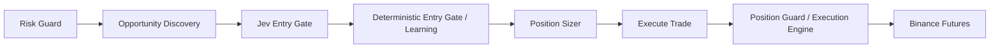

# Jev en Aterum

Implementación preparada el 2026-09-24. No se desplegaron servicios, no se activaron workflows y no se cambiaron secretos. Falta una clave con acceso efectivo a Jev; las llamadas al proveedor y Telegram se comprobaron con clientes simulados.

## API auténtica y decisión técnica

Fuentes oficiales consultadas:

- https://typesafe.ai/blog/introducing-system-one-models-and-jev
- https://docs.typesafe.ai/api
- https://docs.typesafe.ai/models

Se usa `POST https://api.typesafe.ai/v1/systemone`, Bearer `TYPESAFE_API_KEY`, y el alias oficial `jev-latest`. El cuerpo contiene `model`, `state` y `questions`; la pregunta `choice` contiene `instructions` y `criteria`. Se valida `answers[questionId].type`, `choice`, `probabilities`, `confidence` y el modelo devuelto. Se conserva el nombre concreto del modelo devuelto para auditoría. No se usa un contrato de chat ni un esquema inventado de generación de precios.

Jev selecciona una opción entre `NO_TRADE`, `LONG` y `SHORT`. Cada opción de operación contiene un par numérico de SL/TP ya calculado. Se ofrecen los niveles de la política existente para cada lado: distancia SL = ATR × slMultiplier (por defecto 1.5); distancia TP = distancia SL × tpMultiplier (por defecto 2). Ambos se ajustan a tickSize real. No se agregaron multiplicadores de riesgo ni políticas nuevas de niveles. Seleccionar LONG/SHORT selecciona también ese par de precios.

## Punto exacto y flujo



El nuevo nodo está en la rama positiva de `If: Setup Found`, antes de `Deterministic Entry Gate`. Consulta `POST /internal/jev/evaluate` en Dashboard con el token interno existente. El endpoint es dueño de los flags; un error de comunicación bloquea la entrada. Los endpoints `/internal/*` no se publican por nginx y requieren Bearer incluso dentro de la red.

Jev tiene autoridad sobre la decisión de entrada y dirección. Puede elegir el lado contrario al selector técnico, incluso con un score menor. En enforce, Discovery entrega un candidato con datos y capacidad operativa aunque su score esté bajo el umbral, su dirección sea NEUTRAL o Learning recomiende bloquearlo. Ranking todavía prioriza el símbolo a analizar; no se consulta todo el universo a Jev en cada ciclo.

Los scores, ambigüedad y bloqueos estadísticos de Learning son evidencia, no vetos estratégicos. Learning sigue ejecutándose y registrando su recomendación; únicamente sus rechazos SCORE_BELOW_THRESHOLD/LEARNING_HARD_BLOCK con capital explícitamente habilitado pueden quedar como recomendaciones. Un HALT de capital, servicio caído o rechazo desconocido sigue bloqueando. En disabled/observe se mantiene la política de entrada original.

Cada scan conserva evidencia LONG y SHORT calculada desde las mismas velas. Al elegir Jev, se transmiten los indicadores, contribuciones, score, confirmación 4H y setup del lado seleccionado, y se vuelve a consultar Learning para ese setup. La correlación del portfolio se calcula para ambos lados y se exige la del elegido, sin reutilizar el veto del lado anterior. Se mantienen liquidez, cooldown, posiciones existentes, capital y demás restricciones operativas.

Position Sizer conserva multiplicadores de riesgo, capital, margen, apalancamiento y Efficiency Gate, y dimensiona usando la distancia al SL elegido. En modo enforce no cambia a otro símbolo si falla el tamaño: una propuesta no autoriza un símbolo alternativo. El fallback original permanece en disabled/observe.

`Execute Trade` sigue llamando exclusivamente `POST /executions`. El ID se deriva de la decisión persistida; los reenvíos usan el mismo ID y un máximo de un intento del motor para aperturas Jev. No se reintenta la API Jev. El mecanismo existente de recuperación por clientOrderId se conserva para resolver aperturas cuyo resultado quedó incierto.

Dentro de `ExecutionEngine.openPosition`, inmediatamente después de obtener reglas y precio actuales, `validateJevExecution` consulta la decisión persistida. Comprueba símbolo, dirección, modo, identidad de ejecución, expiración, precios inalterados, tick/min/max y lado respecto del precio actual. Luego continúan los controles existentes de mínimos, capacidad del portfolio y modo de cuenta antes de modificar margen/apalancamiento o enviar MARKET. Una orden ya recuperada de Binance debe completar su protección y persistencia aunque la decisión haya vencido; no se bloquea esa recuperación.

SL/TP siguen llegando como `stopLoss`/`takeProfit` al motor. Éste crea y relee STOP_MARKET/TAKE_PROFIT_MARKET y persiste los precios confirmados con `persistOpenState`. SL Monitor, Trailing Manager, sincronización y cierre no cambian sus reglas.

## Datos, vigencia y auditoría

- `marketDataAt` marca el inicio del scan, conservadoramente antes de todas las consultas. Los indicadores y velas no se rejuvenecen al llamar a Jev.
- Se vuelve a consultar ticker de Binance con su símbolo/timestamp y exchangeInfo; se rechazan datos futuros o vencidos y desplazamientos mayores al límite configurado.
- `state` v2 incluye símbolo/ciclo, timestamps, precio/filtros, velas, indicadores, volumen, OI, scores/contribuciones, 4H, macro/inteligencia, riesgo, balance y capacidad ya usados por Aterum. No se envía el objeto de workflow completo ni credenciales.
- `jev_decisions` conserva request reproducible, opciones numéricas, respuesta validada, modelo efectivo, propuesta, decisión tras validación, motivo y expiración. El ID único ciclo/símbolo se reserva antes de consultar la API. Una evaluación incompleta no se repite automáticamente.
- Learning registra su recomendación incluso cuando Jev discrepa; los rechazos efectivos de Learning/sizing se registran mediante `/db/rejection` y `/db/scan`. El motor conserva motivo y estado en `trade_executions`/`trade_execution_events`. Una propuesta persistida LONG no significa que haya sido ejecutada: el resultado definitivo se consulta en el motor.
- Un fallo de DB bloquea la entrada; si no se puede persistir, queda el código genérico en logs del servicio.
- La migración `database/migrations/20260924_jev.sql` permite preparar tablas; también se crean idempotentemente al usarse. No fue aplicada a una base real.

## Variables

| Variable | Valor inicial / propósito |
|---|---|
| `TYPESAFE_API_KEY` | Vacía; clave de cuenta con acceso efectivo a Jev, sólo en Dashboard |
| `JEV_ENABLED` | `false`; habilita evaluación |
| `JEV_OBSERVE_ONLY` | `true`; registra la propuesta conservando la decisión del bot existente |
| `JEV_MODEL` | `jev-latest`; alias oficial, modelo resuelto registrado |
| `JEV_TIMEOUT_MS` | `5000`; presupuesto total validado antes de aceptar la propuesta |
| `JEV_MAX_DATA_AGE_MS` | `120000`; antigüedad máxima, también comprobada en el motor |
| `JEV_MAX_PRICE_DRIFT_PCT` | `0.5`; desviación máxima de precio |
| `JEV_PROVIDER` | `typesafe` para Jev real o `typesafe-adapter` para el adaptador oficial |
| `JEV_ADAPTER_TOKEN` | Secreto interno entre Dashboard y el sidecar Python |
| `JEV_ADAPTER_URL` | URL interna; Docker usa `http://typesafe_adapter:8088` |
| `JEV_ADAPTER_ANTHROPIC_API_KEY` | Credencial de Anthropic exclusiva para el sidecar; puede usar `ANTHROPIC_API_KEY` como fallback |
| `JEV_ADAPTER_MODEL` | Modelo Anthropic del adaptador; por defecto `claude-haiku-4-5-20251001` |
| `JEV_ADAPTER_MAX_TOKENS` | Máximo de salida del proveedor; por defecto `512` |
| `EXECUTION_ENGINE_TOKEN` | Secreto existente, idéntico en Dashboard, n8n y Position Guard |
| `TELEGRAM_BOT_TOKEN`, `TELEGRAM_CHAT_ID` | Destino de notificaciones; ahora también se pasan a Dashboard |
| `N8N_TRADING_DISABLED` | `1` impide solicitudes de apertura en Execute Trade, incluso con Jev deshabilitado |

Dashboard y Position Guard deben recibir los mismos flags Jev. Observe **no suspende por sí solo el trading original**: para observar sin ninguna apertura, mantener `N8N_TRADING_DISABLED=1` y el workflow de entrada sin activar hasta probarlo manualmente. El chequeo explícito de esta variable se agregó porque existía en Compose pero el nodo no la consultaba.

## Adaptador oficial de TypeSafe

Cuando TypeSafe no admite altas nuevas, `typesafe-adapter/` ejecuta el [System One Adapter oficial](https://github.com/typesafe-ai/system-one-adapter-python) versión 0.2.1. Es un sidecar privado de Python: recibe el mismo `state` y la pregunta Choice ya construidos por Aterum y usa la salida estructurada nativa de Anthropic. El proveedor nunca recibe credenciales de Binance, n8n, Telegram ni la base de datos.

Se ejecuta con `docker compose --profile ai up -d --build typesafe_adapter dashboard position_guard`. El puerto 8088 no se publica al host ni nginx. En el Dashboard se configura `JEV_PROVIDER=typesafe-adapter`; Position Guard recibe el mismo valor para que una propuesta enforce no pueda saltarse su verificación. El adaptador no hace reintentos de proveedor ni correcciones de formato: una respuesta tardía, inválida o un fallo resulta en `NO_TRADE` en el Dashboard. Esto evita duplicar una decisión de entrada.

La salida conserva la forma TypeSafe (`answers`, probabilities y confidence) pero `model` será el nombre de Claude, no `jev-*`. La auditoría registra `answer.provider=typesafe-adapter` y el modelo devuelto. El adaptador es una sustitución temporal de interfaz, no Jev: no aporta sus probabilidades calibradas ni sus garantías de latencia.

## Telegram comprobado

Los nodos `Telegram:*` del workflow principal usan el servicio de entrega persistente. Las propuestas indican `PROPUESTA`, observe/enforce, resultado y motivo, y que no confirman una orden. La notificación de apertura mantiene el requisito VERIFIED + pipelineVerified + persistencia VERIFIED. Los fallos del motor y del workflow comparten la clave del evento; los cierres conservan su propietario único por lifecycle.

La tabla `notification_deliveries` reserva el evento antes de enviar y registra `SENT`, `FAILED` o `UNKNOWN`, message_id y un código de error sin token. Se comprueban tanto el HTTP como `ok` y message_id. Se usa texto plano en los avisos operativos para evitar errores de parseo HTML. También se saneó el error de transporte del bot interactivo; su fallback de formato sólo ocurre tras un rechazo explícito de parsing.

Telegram no tiene una clave de idempotencia de envío. Se eligió entrega como máximo una vez: ante timeout, caída tras reservar o resultado ambiguo, no se reenvía automáticamente. Esto evita duplicados, pero puede requerir revisión manual de un aviso no entregado. El resultado del trading se consulta en Binance/DB independientemente del mensaje.

Comprobado con clientes simulados: NO_TRADE/LONG/SHORT, rechazo por validación/riesgo, apertura confirmada, ejecución fallida y cierre confirmado; HTTP 200 con ok=false, errores de transporte, concurrencia, reenvíos y ausencia de secretos en errores. No se enviaron mensajes reales. Hay entradas locales de Telegram, pero no están identificadas como credenciales de prueba: quedan pendientes permisos efectivos del bot, pertenencia al chat y entrega real en un chat de pruebas autorizado.

## Despliegue y transición a operación

1. Para Jev real, conseguir acceso early access y `TYPESAFE_API_KEY`. Para el adaptador, generar `JEV_ADAPTER_TOKEN`, configurar `JEV_ADAPTER_ANTHROPIC_API_KEY` y elegir `JEV_ADAPTER_MODEL`. Configurar también un chat/bot de pruebas. No se comprobó autenticación, cuota ni una respuesta real de ningún proveedor por falta de credenciales de pruebas.
2. Preparar las tablas en una DB de staging. Configurar el token interno existente en los tres servicios; usar las plantillas actualizadas sin sobrescribir `.env` productivo.
3. Configurar `JEV_ENABLED=true`, `JEV_OBSERVE_ONLY=true`, `N8N_TRADING_DISABLED=1`. Para el adaptador, definir `JEV_PROVIDER=typesafe-adapter` en Dashboard y Position Guard, y levantar el perfil `ai`. Construir Dashboard/Position Guard y recrear los servicios afectados. Dashboard, Chart API y n8n comparten namespace: al recrear Dashboard, recrear también Chart API, n8n y nginx según el README.
4. Importar/actualizar **el workflow existente** con `advanced-ai-trading-bot-v2-clean.workflow.json` sin activarlo ni mantener dos schedules. El script `node scripts/integrate-jev-workflow.js` sólo actualiza snapshots offline, nunca importa ni activa.
5. Ejecutar manualmente un scan de observación en staging; revisar `jev_decisions`, `notification_deliveries`, latencia, expiraciones y propuestas. Verificar autenticación real de Jev y mensajes en el chat de pruebas. Si el mercado/indicadores carecen de vigencia, se rechaza: no falsear timestamps para continuar.
6. Antes de operación real, confirmar que todos los controles de cuenta/portfolio, modo Hedge, permisos Binance, protección y cierres funcionan en el entorno destino. Los tests locales no prueban esos permisos ni una ejecución real.
7. Para que Jev gobierne aperturas: cambiar `JEV_OBSERVE_ONLY=false` **en Dashboard y Position Guard**, conservar `JEV_ENABLED=true`, recrear ambos y los servicios que comparten namespace. Tras verificar la configuración y recibir autorización operativa, poner `N8N_TRADING_DISABLED=0` en n8n y activar un solo workflow principal. Esta implementación no hizo esos pasos.
8. Para detener nuevas aperturas: `N8N_TRADING_DISABLED=1`. Mantener monitores y Position Guard para las posiciones existentes. Volver a observe invalida propuestas enforce pendientes; no cierra posiciones ni elimina su protección.

## Verificación local

`npm run test:offline` permite reproducir toda la suite sin cargar `.env` y con red bloqueada. Resultado: **28/28 archivos**. La suite específica tiene **33 casos**, todos aprobados. La validación `docker compose --env-file docker.env.example --profile ai config --quiet` pasó sin levantar servicios.

`npm run test:jev` cubre el contrato API, API caída/tardía, niveles inválidos, símbolo/vigencia, controles, observación, registro persistente simulado, entrega Telegram y reenvío idempotente. `npm run check`, `npm run test:workflow` y `npm run test:execution` también se ejecutaron.

Se ejecutaron además todos los archivos `tests/*.test.js`, `position-guard/*.test.js`, los unitarios de Telegram/Position Guard y la simulación de protección. Se bloquearon conexiones de red y carga de `.env` durante estas pruebas. El adaptador tiene dos pruebas Python con un cliente simulado, y su `/healthz` y rechazo HTTP 401 se probaron localmente. Se corrigió un fixture viejo de `position-guard/simulation-test.js` que todavía simulaba cierre directo en lugar del motor verificado. No se construyeron ni levantaron contenedores ni se probó una base MariaDB real. La construcción Docker no se pudo ejecutar porque esta cuenta no tiene permisos sobre `/home/delcon/.docker/buildx/instances`.

## Inventario de archivos entregados

Rutas relativas a `aterum_gui/` (incluye código, configuración, snapshots, pruebas y documentación):

```text
.env.example
README.md
bot-control/infra/.env.example
bot-control/infra/docker-compose.example.yml
bot-control/infra/nginx/nginx.conf
bot-control/workflows/code/build-entry-rejection-v2.js
bot-control/workflows/code/build-execution-failure-notification-v2.js
bot-control/workflows/code/build-verified-open-notification-v1.js
bot-control/workflows/code/position-sizer-v1-efficiency-gate.js
bot-control/workflows/code/send-telegram-notification-v1.js
bot-control/workflows/current/advanced-ai-trading-bot-v2-clean.workflow.json
bot-control/workflows/current/manifest.json
docker-compose.yml
docker.env.example
nginx/nginx.conf
package.json
position-guard/execution-engine.js
position-guard/guard.js
position-guard/simulation-test.js
services/opportunity_engine.js
telegram-control/telegram.js
tests/telegram_delivery.test.js
tests/workflow_redesign.test.js
trade.js
bot-control/workflows/code/jev-entry-gate.js
database/migrations/20260924_jev.sql
docs/architecture/jev-integration.md
routes/jev.js
scripts/integrate-jev-workflow.js
scripts/test-offline.js
services/jev.js
services/jev_execution.js
services/jev_authority.js
services/telegram_delivery.js
typesafe-adapter/Dockerfile
typesafe-adapter/requirements.txt
typesafe-adapter/service.py
typesafe-adapter/test_service.py
tests/jev.test.js
tests/fixtures/jev_context.js
tests/jev_integration.test.js
tests/jev_routes.test.js
tests/offline.cjs
```
