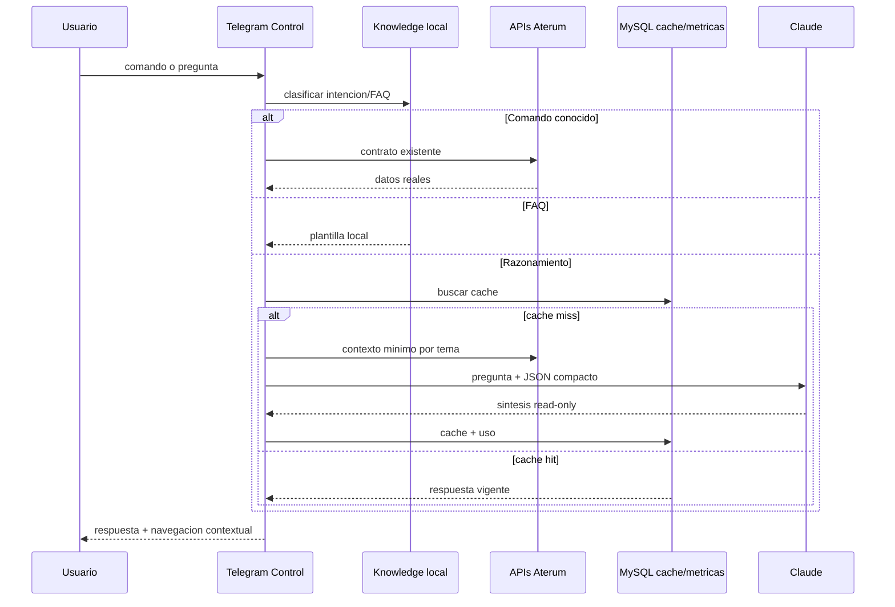

# Router del Copiloto

```mermaid
sequenceDiagram
  participant U as Usuario
  participant T as Telegram Control
  participant K as Knowledge local
  participant API as APIs Aterum
  participant DB as MySQL cache/metricas
  participant C as Claude
  U->>T: comando o pregunta
  T->>K: clasificar intencion/FAQ
  alt Comando conocido
    T->>API: contrato existente
    API-->>T: datos reales
  else FAQ
    K-->>T: plantilla local
  else Razonamiento
    T->>DB: buscar cache
    alt cache miss
      T->>API: contexto minimo por tema
      T->>C: pregunta + JSON compacto
      C-->>T: sintesis read-only
      T->>DB: cache + uso
    else cache hit
      DB-->>T: respuesta vigente
    end
  end
  T-->>U: respuesta + navegacion contextual
```
