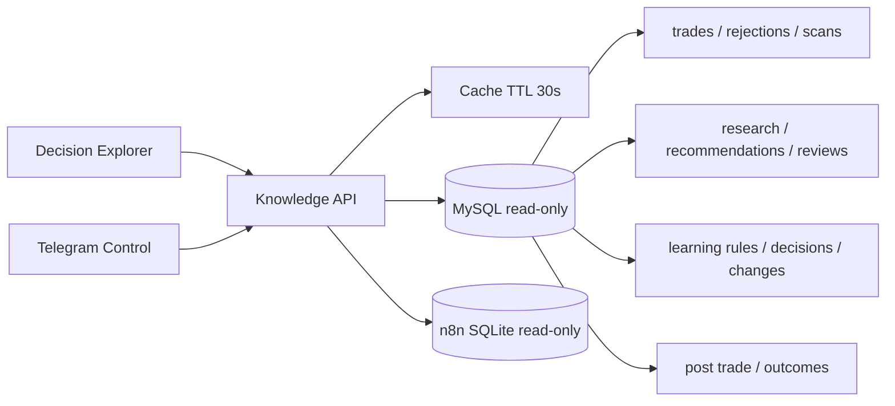

# Knowledge Graph y Decision Timeline

## Arquitectura

No se agregaron tablas. Las relaciones directas usan `trade_id`, `report_id`, `recommendation_id`, `rule_id` y `change_id`. Las relaciones sin FK se reconstruyen con símbolo y ventanas temporales acotadas, y la respuesta identifica el método de correlación.

## Decision Explorer

`/knowledge` lista trades y rechazos mediante referencias estables como `trade:50` y `rejection:588`. El detalle muestra score, threshold, Research, Learning, reglas, recomendaciones, contexto macro, imagen, Simulator, Capital Guard, órdenes, cierre y fuentes faltantes.

## Timeline

Combina timestamps de MySQL con los nodos de la ejecución n8n más cercana. Sólo expone nombre, estado, duración e ID de ejecución; no expone payloads ni credenciales.

## Knowledge Graph

Cytoscape.js representa relaciones entre decisión, scan, reporte, Learning, reglas, recomendaciones, reviews, cambios, post-trade y outcome. `learning_source` significa influencia persistida en `learning_decisions`; `report_context` sólo indica que la recomendación pertenecía al reporte vigente.

## Decision Diff

Compara dos referencias y devuelve únicamente campos distintos. No interpreta ni genera conclusiones.

## Rule Impact

Utiliza `learning_changes` y el último `learning_change_reviews` persistido. Trades afectados, PnL, drawdown, impacto y confianza proceden de `after_metrics` y `metric_deltas`; no se recalculan en la vista.

## Evidencia ausente

Las noticias históricas no fueron persistidas. Se muestran como evidencia ausente y nunca se sustituyen con titulares actuales. Lo mismo ocurre con imagen o Simulator cuando el workflow histórico no guardó esos campos.

## Performance

- cache en memoria de 30 segundos y máximo 300 entradas;
- queries limitadas y sin carga global de ejecuciones;
- n8n limitado a una ejecución dentro de diez minutos;
- índices `symbol,time` en `scan_events` y `trade_rejections`;
- validación inicial: detalle 153 ms sin cache y 2 ms con cache; timeline 2 ms; graph cacheado menor a 1 ms; rules 8 ms.

## Invariantes

Knowledge Graph no escribe decisiones, no modifica workflows y no llama modelos generativos. Decision Pipeline V2 cambió el discovery, scoring y Entry Gate de forma independiente; Position Sizer, Execute Trade, SL Monitor, Trailing Manager, Research, Recommendation Review y Simulator conservan sus responsabilidades.
