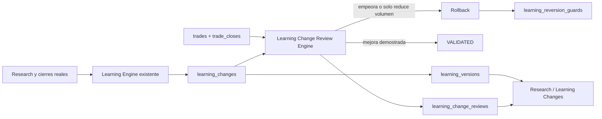

# Learning Change Audit System

Fecha de implementacion: 2026-06-27

## Objetivo

Esta ampliacion convierte cada cambio efectivo del Learning Engine en un evento auditable. No sustituye el calculo de pesos, el Entry Gate, Capital Guard, Position Sizer ni la logica de Research. Observa el estado que esos componentes ya producen, conserva el antes y el despues, mide resultados posteriores y revierte solo cuando existe evidencia suficiente.

## Flujo



## Persistencia

| Tabla | Funcion |
|---|---|
| `learning_changes` | Registro permanente del cambio, valores antes/despues, razon, evidencia, actor, muestra minima y estado. |
| `learning_change_reviews` | Fotografia de las metricas antes/despues en cada revision. |
| `learning_versions` | Timeline legible con version `L-xxxxxx` por evento. |
| `learning_reversion_guards` | Estado estable que impide que una reconstruccion vuelva a aplicar automaticamente una regla revertida. |

No se borran recomendaciones, reportes, reglas, decisiones ni ejecuciones historicas.

## Estados

- `insufficient`: faltan trades en la linea base o posteriores.
- `monitoring`: existe muestra observable, pero aun no alcanza el minimo de validacion.
- `validated`: la mejora supera los umbrales y la prueba de diferencia de R promedio.
- `revert_required`: el resultado empeoro o el cambio solo redujo volumen sin mejorar calidad.
- `reverted`: el estado anterior fue restaurado y existe un evento inverso en el timeline.
- `superseded`: otro estado posterior reemplazo el cambio antes de su validacion.

## Evidencia y proteccion contra sobreajuste

Los valores iniciales se almacenan en `learning_config`:

| Configuracion | Valor | Uso |
|---|---:|---|
| `change_min_sample` | 10 | Muestra minima para pasar de evidencia insuficiente a observacion. |
| `change_validation_sample` | 20 | Muestra minima tanto antes como despues para validar o revertir. |
| `change_baseline_days` | 14 | Ventana anterior a la implementacion. |
| `change_min_expectancy_delta` | 0.05 | Cambio material de expectancy. |
| `change_min_avg_r_delta` | 0.05 | Cambio material de R promedio. |
| `change_min_profit_factor_delta` | 0.10 | Cambio material de Profit Factor. |
| `change_min_win_rate_delta` | 3 | Cambio material de Win Rate en puntos. |
| `change_volume_drop_pct` | 40 | Caida de frecuencia que se considera inutil si no mejora calidad. |
| `change_auto_revert` | 1 | Habilita rollback de componentes con adaptador seguro. |

La comparacion usa trades por dia para no confundir ventanas de distinta duracion. La significancia se estima sobre `R` medio con error estandar combinado; una validacion o reversion por deterioro exige al menos 20 observaciones en ambos lados y confianza equivalente a `|z| >= 1.96`. Una caida de volumen tambien requiere la muestra de validacion completa.

## Reversion

El rollback automatico esta habilitado para:

- `learning_rule`: restaura estado, accion, peso y factores Research/Review; ademas crea un guard persistente.
- `learning_config`: restaura el valor anterior.

Otros componentes pueden registrar cualquier cambio mediante la API, incluyendo ATR, RSI, PSAR, trailing, scores, riesgo, horarios o integraciones. Si no existe un adaptador que pueda restaurarlos de forma determinista, el sistema marca `revert_required` y no modifica produccion a ciegas.

## API

| Metodo | Ruta | Uso |
|---|---|---|
| `GET` | `/api/learning/changes` | Cambios y ultima revision. Acepta `status`, `component` y `limit`. |
| `POST` | `/api/learning/changes` | Registra un cambio externo con antes/despues, actor y evidencia. |
| `GET` | `/api/learning/changes/summary` | KPIs e impacto global antes/despues. |
| `GET` | `/api/learning/timeline` | Versiones cronologicas. |
| `POST` | `/db/learning/review-changes` | Ejecuta revision; `force=true` ignora el intervalo temporal. |

Ejemplo de registro para un componente externo:

```json
{
  "targetType": "trailing_config",
  "targetKey": "trigger_r",
  "component": "Trailing",
  "parameterName": "trigger_r",
  "beforeValue": { "value": 1.2 },
  "afterValue": { "value": 1.5 },
  "reason": "Prueba respaldada por cierres reales",
  "actor": "Operator",
  "evidence": { "sample": 24 }
}
```

## Operacion automatica

El servicio revisa al iniciar y luego cada hora. `change_review_interval_hours=6` evita recalcular un cambio sin datos nuevos o antes del intervalo, salvo revision forzada. Una reconstruccion normal de reglas registra solo diferencias de comportamiento; las metricas descriptivas que no cambian estado o peso no crean versiones.

## Interfaz

`/research` incluye:

- KPIs de aplicados, validados, revertidos, en observacion y pendientes.
- Comparacion global de Win Rate, expectancy, Profit Factor, drawdown, R y frecuencia.
- Tabla Learning Changes con valores antes/despues, razon, muestra, estado y actor.
- Impacto Real por cambio con trades, Win Rate, expectancy, Profit Factor, drawdown y confianza.
- Learning Timeline con version, fecha, responsable y resultado.

## Validacion realizada

- Migracion ejecutada sin recrear tablas ni borrar historico.
- Nueve reglas activas historicas registradas como baseline auditable.
- Las 63 reglas conservaron exactamente su estado, accion, peso y factores durante el bootstrap.
- Las nueve revisiones iniciales quedaron en `insufficient`; no hubo decisiones con menos de la muestra minima.
- Pruebas unitarias cubren mejora, deterioro, reduccion inutil de volumen y muestra insuficiente.
- Prueba transaccional de rollback verifico restauracion, guard e evento inverso y fue revertida al terminar; no dejo datos de prueba.

