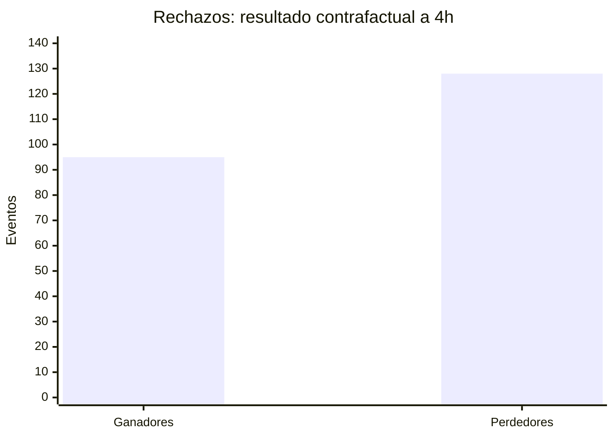
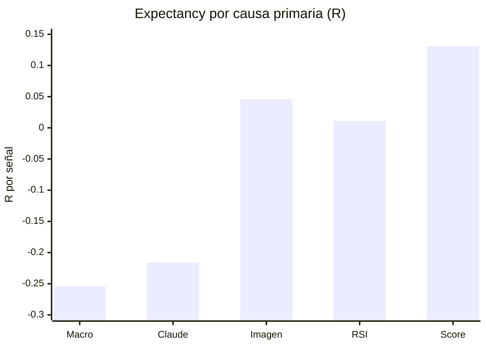

# Auditoria cuantitativa de rechazos de IA

**Corte de datos:** 2026-06-27 20:30:47 UTC  
**Mercado posterior:** Binance Futures, velas de 1 minuto, consultado el 2026-06-27 20:36 UTC  
**Cambios aplicados al sistema:** ninguno

## Veredicto ejecutivo

No hay evidencia de que los rechazos, como conjunto, esten destruyendo la rentabilidad. El contrafactual estatico de 4 horas sobre 223 eventos con ventana completa produce:

| Metrica | Resultado |
|---|---:|
| Rechazos evaluables | 223 |
| Hipoteticamente ganadores | 95 |
| Hipoteticamente perdedores | 128 |
| Win Rate | 42.6% |
| Profit Factor | 0.682 |
| Expectancy | -0.121R |
| Oportunidad bruta rechazada | +57.55R |
| Perdidas brutas evitadas | 84.42R |
| Resultado neto de aceptar todos | **-26.87R** |

Una aproximacion conservadora del Trailing Manager, evaluada al cierre de cada minuto, tambien queda negativa: 47.1% de acierto, Profit Factor 0.673, expectancy -0.112R y -24.88R netos.

La conclusion debe matizarse: los 231 rechazos representan 109 episodios de mercado y muchas observaciones se solapan cada 15 minutos. Al reagrupar por simbolo, direccion y pausas de dos horas, el intervalo bootstrap de expectancy cruza cero: `[-0.272R, +0.023R]` para el bracket estatico y `[-0.245R, +0.012R]` con trailing aproximado. El estimador apunta a que rechazar fue favorable, pero la independencia estadistica aun no es suficiente para afirmar causalidad general.

El filtro visual tampoco puede declararse culpable ni beneficioso. Sus 47 decisiones causales completas tienen expectancy estatica de `+0.046R`, pero el intervalo por episodios es `[-0.265R, +0.382R]`. Con trailing aproximado queda en `-0.059R`, intervalo `[-0.310R, +0.200R]`. La muestra no demuestra que el filtro visual destruya el edge.

## Hallazgos principales

1. `trade_rejections` contiene 458 filas, pero solo **231 eventos unicos**. Cada rechazo se escribe dos veces.
2. `scan_events` contiene 717 filas: 687 rechazadas que representan 231 eventos unicos y 30 aceptadas. La mayoria de los rechazos aparece tres veces.
3. La duplicacion es determinista: cada nodo `Build AI Skip Message*` llama dos veces a `/db/rejection`; cada llamada tambien crea un `scan_event`, y el nodo llama adicionalmente a `/db/scan`.
4. Los rechazos hipoteticos fueron peores que los trades aceptados, aunque la comparacion no es perfectamente homogenea. Los 37 cierres reales tienen WR 45.95%, PF 0.860, expectancy -0.081R y -2.98R. Los rechazados dan WR 42.6%, PF 0.682 y -0.121R a cuatro horas.
5. Los rechazos con texto `fallback` son claramente protectores: 24 casos, PF 0.119 y expectancy -0.433R; el intervalo por 19 episodios permanece negativo.
6. Los textos `sin confirmacion` tambien fueron utiles: 10 casos, PF 0.043 y expectancy -0.670R; intervalo por episodios `[-1.000R, -0.306R]`.
7. `LATE_TREND` es la alerta mas sospechosa, pero no hay muestra suficiente para modificarla: 21 ventanas completas, PF 1.681 y +0.196R con bracket estatico; al reproducir trailing queda PF 0.975 y -0.007R. Ambos intervalos cruzan cero.
8. Research no genero ningun rechazo directo. Learning solo aparece en dos rechazos persistidos, y ambos ya venian rechazados por la logica base. No existe muestra para medir precision independiente de Research o Learning.
9. El Simulator no reproduce produccion. Omite Risk Guard, Learning, Position Sizer, trailing, errores de ejecucion y el dimensionamiento real. El `+$16` es una conversion visual de un movimiento aproximado del 16% sobre `$100` a 1x, no un PnL esperado de produccion.

## Fuentes auditadas

| Fuente | Filas disponibles | Cobertura util |
|---|---:|---|
| `trade_rejections` | 458 | 231 eventos unicos, 2026-06-23 a 2026-06-27 |
| `scan_events` | 717 | 231 rechazos unicos y 30 aceptaciones |
| `post_trade_analysis` | 29 | 28 cierres enlazados; 9 cierres sin analisis enlazado |
| `research_reports` | 7 | Reportes agregados; no contienen resultado contrafactual por rechazo |
| `recommendation_reviews` | 162 | Evaluan recomendaciones implementadas, no decisiones de rechazo individuales |
| `learning_decisions` | 6 | 5 rechazos y 1 aprobacion; solo 2 rechazos coinciden con telemetria de produccion |
| Ejecuciones n8n conservadas | 53 | Todas del 2026-06-27; 22 rechazos con payload completo |
| Trades cerrados | 37 | PnL real -$8.02, PF USD 0.865 |

Los 231 registros reconstruidos individualmente estan en [rejection-audit-events.csv](./rejection-audit-events.csv). El CSV incluye hora, simbolo, direccion, entry, SL, TP, scores disponibles, contexto, motivo exacto, MFE, MAE, primer nivel tocado y resultado con trailing aproximado.

## Calidad y limites de los datos

### Campos recuperables

Para los 231 eventos existen simbolo, direccion, precio teorico, ATR%, score final, scan score, RSI, volumen, 4H, macro, estado visual y motivo de rechazo. Todos pudieron enlazarse exactamente con `scan_events` por simbolo, direccion, motivo y segundo.

### Campos no persistidos

| Campo solicitado | Estado |
|---|---|
| Imagen original | No disponible. El workflow ejecuta `Delete Image`; no hay charts historicos retenidos. |
| Research Score por trade | No existe. Research ofrece contexto/politica, no un score historico persistido por señal. |
| Learning Score | Disponible solo en 6 decisiones; 2 coinciden con rechazos del corte. |
| Threshold dinamico | Exacto en 22 ejecuciones n8n; recuperable desde el texto en parte del historico. |
| `sl_multiplier` / `tp_multiplier` | Exactos en las ejecuciones n8n retenidas; no persistidos antes del 27. |
| Balance, qty y riesgo por rechazo | Solo recuperables en las 22 ejecuciones n8n retenidas. |
| PnL USD contrafactual | No identificable para el historico sin inventar balance y qty. Se reporta en R. |

Para eventos sin payload n8n se uso la configuracion por defecto de produccion: `SL = 1.5 ATR` y `TP = 2 x distancia SL`. El entry es el `current_price` realmente persistido. El CSV marca estos niveles como `production-defaults-reconstructed`; no se presentan como niveles individualizados por Claude.

## Metodologia contrafactual

1. Se deduplicaron rechazos por simbolo, direccion, motivo y timestamp al segundo.
2. Se tomo `scan_events.current_price` como entrada teorica.
3. Se reconstruyeron SL y TP con los multiplicadores retenidos en n8n cuando existian; en el resto se usaron los defaults de produccion.
4. Se descargaron velas reales de Binance Futures de un minuto posteriores al rechazo.
5. La evaluacion comienza en el primer minuto completo posterior al timestamp para no usar precios anteriores a la decision.
6. TP y SL se evaluaron por high/low. No hubo velas de un minuto con TP y SL simultaneos.
7. Si ningun nivel se toco, se marco a mercado al terminar la ventana de cuatro horas.
8. Las ocho señales sin cuatro horas futuras completas quedaron censuradas y se excluyeron de estadisticas.
9. Se calculo una segunda version que aproxima el Trailing Manager al cierre de cada minuto: breakeven en 1R, lock de 0.5R en 1.5R y trailing desde 2R. Es una aproximacion, no una reproduccion tick a tick.

No se incluyen comisiones, funding, slippage ni competencia por capital. La suma en R responde a "que habria pasado con cada señal por separado"; no es un backtest de cartera que pueda ejecutar simultaneamente los 231 trades.

## Resultado global

| Horizonte / gestion | N | Wins | Losses | WR | PF | Exp. | Neto |
|---|---:|---:|---:|---:|---:|---:|---:|
| 4h, SL/TP inicial | 223 | 95 | 128 | 42.6% | 0.682 | -0.121R | -26.87R |
| 4h, trailing aproximado | 223 | 105 | 118 | 47.1% | 0.673 | -0.112R | -24.88R |
| 20h, SL/TP inicial | 189 | 62 | 127 | 32.8% | 0.651 | -0.206R | -39.02R |
| Produccion, 37 cierres reales | 37 | 17 | 20 | 45.9% | 0.860 | -0.081R | -2.98R |

En cuatro horas, 9 rechazos tocaron TP, 68 tocaron SL y 146 seguian dentro del bracket al cierre. En la aproximacion con trailing, 10 operaciones que eran perdedoras bajo SL estatico pasaron a resultado no negativo al haber alcanzado primero 1R.

## Precision por filtro

La tabla usa la causa primaria expresada por el workflow, no simples menciones. Un rechazo se considera correcto si aceptar la señal habria dado resultado negativo a cuatro horas.

| Causa primaria | Total | N completo | Correctos | Falsos negativos | PF | Expectancy | Episodios | Evidencia |
|---|---:|---:|---:|---:|---:|---:|---:|---|
| Macro hard block | 59 | 59 | 39 | 20 | 0.459 | -0.254R | 22 | Favorable, pero CI por episodios cruza 0 |
| Claude / AI context | 58 | 57 | 37 | 20 | 0.466 | -0.216R | 38 | Favorable; borde estadistico |
| Imagen | 48 | 47 | 23 | 24 | 1.129 | +0.046R | 35 | Inconclusa |
| RSI | 35 | 35 | 15 | 20 | 1.038 | +0.011R | 13 | Inconclusa |
| Score / threshold | 10 | 9 | 4 | 5 | 2.330 | +0.131R | 8 | Inconclusa, muestra minima |
| Bias AI | 8 | 6 | 4 | 2 | 0.472 | -0.183R | 3 | Insuficiente |
| Ranging | 4 | 4 | 3 | 1 | 0.542 | -0.155R | 4 | Insuficiente |
| Volumen | 4 | 4 | 1 | 3 | 3.313 | +0.107R | 3 | Insuficiente |
| 4H como motivo primario | 3 | 2 | 2 | 0 | 0.000 | -1.000R | 2 | Insuficiente |
| Learning wrapper | 2 | 0 | - | - | - | - | 0 | Censurado; rechazo base previo |
| Research | 0 | 0 | - | - | - | - | 0 | No actua como filtro negativo directo |

### Atribucion multiple

Los filtros no son independientes. Por ejemplo, 32 eventos combinan rechazo visual y macro contradictorio. Tomando menciones/condiciones, no causa primaria:

| Filtro presente | N completo | Wins si se aceptaba | Losses si se aceptaba | PF | Expectancy |
|---|---:|---:|---:|---:|---:|
| Imagen | 73 | 39 | 34 | 1.098 | +0.033R |
| Macro | 100 | 37 | 63 | 0.525 | -0.206R |
| Intelligence | 47 | 20 | 27 | 0.577 | -0.172R |
| 4H contradictorio | 16 | 8 | 8 | 1.332 | +0.166R |
| Claude / AI | 67 | 23 | 44 | 0.470 | -0.209R |

Esto impide sumar "aportes" por filtro: una misma perdida evitada puede estar atribuida a macro, Intelligence y Claude al mismo tiempo. En particular, los 16 casos con 4H contradictorio no respaldan un hard block general; solo los dos donde 4H fue la causa primaria perdieron, mientras el conjunto completo es mixto.

## Auditoria del modelo visual

### Veredictos visuales

La vision nego explicitamente 70 señales. En 68 ventanas completas produjo WR 50.0%, PF 0.793 y expectancy -0.075R. El intervalo bootstrap es `[-0.261R, +0.120R]`. No hay evidencia estadistica de sobre-rechazo global.

Las 146 señales donde vision aprobaba pero otro filtro rechazo fueron peores: 143 completas, WR 39.9%, PF 0.644 y expectancy -0.142R. Esto indica que el modelo visual no es el origen dominante de la selectividad observada.

### Frases observadas

| Frase | N | WR hipotetico | PF | Expectancy | Lectura |
|---|---:|---:|---:|---:|---|
| `fallback` | 24 | 16.7% | 0.119 | -0.433R | Rechazo claramente util |
| `sin confirmacion` | 10 | 20.0% | 0.043 | -0.670R | Rechazo claramente util |
| `falta confirmacion` | 3 | 0.0% | 0.000 | -0.517R | Favorable, muestra insuficiente |
| `consolidacion` | 4 | 25.0% | 0.120 | -0.442R | Favorable, muestra insuficiente |
| `rebote` | 18 | 50.0% | 0.966 | -0.012R | Sin aporte medible |
| `sobrevendido` | 13 | 61.5% | 1.557 | +0.120R | Posible falso negativo; muestra pequena |
| `conflicto` | 23 completos | 43.5% | 0.844 | -0.059R | Leve aporte protector |
| `LATE_TREND` | 21 completos | 61.9% | 1.681 | +0.196R | Sospechoso en estatico; neutro con trailing |

No existen ocurrencias literales de `esperar ruptura`, `rango` o `estructura lateral` en `skip_reason`; hay expresiones semanticamente parecidas, pero no se contaron como iguales para evitar clasificacion subjetiva.

## Caso score 91

Se encontraron cuatro eventos con score final 91, no uno:

| Hora UTC | Simbolo | Motivo | Resultado estatico 4h | Trailing aproximado |
|---|---|---|---:|---:|
| 2026-06-24 12:00 | SPCXUSDT SHORT | Imagen: consolidacion, falta ruptura | -1.00R | +0.04R, breakeven |
| 2026-06-24 19:00 | MUUSDT SHORT | Imagen: consolidacion, falta momentum | -1.00R | -1.00R |
| 2026-06-25 15:15 | ETHUSDT SHORT | Vol spike 4.4x | -0.19R | -0.19R |
| 2026-06-25 15:45 | SPCXUSDT SHORT | Imagen: soporte y reversa incipiente | -0.20R | -0.20R |

El SPCXUSDT mencionado alcanzo 1R a las 13:11 UTC y el SL inicial a las 15:18 UTC. El Trailing Manager habria intentado mover a breakeven antes del retroceso. Por tanto, la imagen no elimino un TP en ese caso: evito una operacion que, segun el manejo aplicado, probablemente habria terminado cerca de break even.

## Falsos negativos relevantes

Estos rechazos alcanzan los mejores resultados incluso al aproximar el trailing de produccion:

| Hora UTC | Simbolo | Dir. | Score | Resultado | Filtro / motivo resumido |
|---|---|---:|---:|---:|---|
| 2026-06-23 04:00 | DRAMUSDT | SHORT | 50 | +2.00R | AI: conflicto Intelligence, macro y RSI |
| 2026-06-23 04:15 | SKHYNIXUSDT | SHORT | 25 | +2.00R | LATE_TREND |
| 2026-06-24 12:45 | LABUSDT | LONG | 41 | +2.00R | Imagen: correccion tras rally |
| 2026-06-25 08:45 | SYNUSDT | LONG | 37 | +2.00R | AI: macro bearish y noticia BTC |
| 2026-06-26 12:15 | AAVEUSDT | LONG | 0 | +2.00R | Macro hard block |
| 2026-06-27 15:30 | SLXUSDT | LONG | 37 | +1.50R | AI: conflicto macro / chart 4H |
| 2026-06-24 15:00 | SNDKUSDT | SHORT | 65 | +1.35R | Imagen: recuperacion temprana |
| 2026-06-25 02:00 | SKHYNIXUSDT | LONG | 0 | +1.26R | Macro hard block |

Los falsos negativos existen, pero no prueban por si solos que el filtro sea malo. El mismo sistema evito 128 resultados negativos a cuatro horas.

## Simbolos

| Simbolo | N completo | WR hipotetico | PF | Expectancy | Lectura |
|---|---:|---:|---:|---:|---|
| REUSDT | 13 | 84.6% | 4.669 | +0.293R | Posible sobre-rechazo; 2 eventos censurados |
| SKHYNIXUSDT | 18 | 55.6% | 1.727 | +0.215R | Posible sobre-rechazo |
| SPCXUSDT | 14 | 57.1% | 1.467 | +0.152R | Posible sobre-rechazo |
| SOXLUSDT | 22 | 59.1% | 1.696 | +0.082R | Posible sobre-rechazo |
| ETHUSDT | 11 | 18.2% | 0.085 | -0.381R | Rechazos protectores |
| HYPEUSDT | 7 | 14.3% | 0.072 | -0.657R | Rechazos protectores |
| WLDUSDT | 9 | 11.1% | 0.180 | -0.531R | Rechazos protectores |
| ZECUSDT | 4 | 25.0% | 0.109 | -0.668R | Favorable, muestra pequena |

Son asociaciones, no reglas operativas. Varias filas de un mismo simbolo pertenecen al mismo movimiento de mercado.

## Comparacion con Simulator

| Componente | Produccion | Simulator actual | Diferencia material |
|---|---|---|---|
| Fuente | MySQL + n8n + Binance | Ultimas ejecuciones n8n retenidas | Solo ve 53 ejecuciones del dia 27 |
| Risk Guard | Circuit breaker, sesiones, DD, max posiciones | No se reproduce | Si |
| Scoring | Logica real 1H/4H | Usa score ya calculado | Parcial |
| Claude | Decide y ajusta score | Reutiliza salida historica | No reevalua |
| Imagen | Rama condicional y veredicto | Reutiliza salida si la rama existio | No procesa imagen |
| Research | Puede aliviar threshold via policy | Genera policy desde su propio reporte | Circular y no es contrafactual independiente |
| Learning | Gate posterior a AI | **Ignorado** | Si |
| Position Sizer | Riesgo, balance, macro, 4H, vision, regimen, margen | **Ignorado** | Si |
| SL/TP | ATR absoluto y multiplicadores de AI | `1.5 x ATR%`, TP 2:1 | Simplificado |
| Trailing / time locks | Activos | **Ignorados** | Si |
| PnL | Qty real y precio | `capital UI x leverage UI x retorno` | No comparable |
| Errores de orden | Pueden impedir apertura | `approved_no_execute` se descarta | Sesgo de seleccion |
| Costes | Ejecucion real | Sin fees, funding ni slippage | Si |
| Sin datos | No aplica | Puede cargar `sample-report.json` | Riesgo de mostrar muestra como real |

El reporte actual del Simulator contiene 23 señales visibles: 22 clasificadas como rechazadas y 1 abierta; una carece aun de futuro suficiente. Las dos filas que tocaron TP eran SLXUSDT con objetivos de 16.35% y 16.19%. Con el valor por defecto de `$100` y `1x`, la UI las transforma mecanicamente en aproximadamente `+$16`.

Ademas, n8n conserva 10 errores del workflow principal el 27 de junio: 9 en `Execute Trade` por HTTP 400 y 1 en la generacion del chart. Los nueve aprobados que fallaron al ejecutar se clasifican internamente como `approved_no_execute` y el Simulator los elimina. Esto sesga cualquier comparacion visual entre "rechazados" y "operados".

## Research, Learning y reportes

Los reportes diarios afirman varias veces que una tasa de rechazo cercana al 95% es "protectora", pero no habian simulado el mercado posterior de cada rechazo. Esas frases son interpretaciones de Claude, no evidencia para esta auditoria.

`recommendation_reviews` mide antes/despues de recomendaciones implementadas y requiere muestras minimas. No enlaza recomendaciones con rechazos individuales, por lo que sus 162 filas no pueden usarse para calcular precision de filtros.

`learning_decisions` solo contiene seis filas. Dos rechazos coinciden con los eventos HYPEUSDT y REUSDT al final del corte; en ambos `incomingAllowed` ya era falso y Learning preservo el rechazo base. Las otras decisiones no tienen rechazo coincidente y corresponden a pruebas o llamadas fuera del flujo persistido. No existe precision independiente de Learning medible en este periodo.

## Propuesta V2, no implementada

La evidencia actual no justifica relajar globalmente ningun hard block. La V2 propuesta debe empezar en shadow mode:

1. **Persistencia completa por gate.** Guardar `decision_id`, base score, AI score, Research factor, Learning factor, threshold, imagen/hash, prompt/modelo, SL/TP multipliers, balance, qty y decision de cada filtro.
2. **Un evento, una fila.** Asignar idempotency key a `/db/rejection` y dejar una sola escritura de `scan_events`.
3. **Simulator con paridad.** Leer `trade_rejections`, evaluar el gate final posterior a Learning, ejecutar el mismo Position Sizer y reproducir Trailing/SL Monitor. Nunca usar muestra ficticia cuando no hay datos.
4. **Incluir aprobados no ejecutados.** Separar `rejected`, `approved`, `execution_failed` y `opened`; no descartar HTTP 400.
5. **Evaluacion por episodios.** Exigir al menos 50 episodios independientes por filtro y por simbolo, no 50 scans solapados.
6. **Visual en shadow mode.** Registrar que habria decidido sin bloquear. `LATE_TREND` puede probarse como penalizacion de score, pero su muestra actual no permite promover ese cambio.
7. **Consenso probabilistico.** Solo despues de calibrar cada gate, convertir rechazos absolutos dudosos en penalizaciones y mantener hard blocks unicamente donde el limite inferior del intervalo confirme expectancy negativa.
8. **No tocar filtros con evidencia favorable.** Mantener por ahora `fallback` y `sin confirmacion`; son los unicos motivos textuales con resultado negativo robusto por episodios.

### Criterio para una futura modificacion

Un filtro deberia cambiar solo cuando cumpla simultaneamente:

- al menos 50 episodios independientes;
- intervalo bootstrap del 95% completamente por encima de 0R para los rechazados;
- resultado consistente con el Trailing Manager;
- comparacion contra un grupo aceptado equivalente por simbolo, hora, regimen y score;
- costes y restricciones de capital incluidos.

Con los datos actuales, ninguna relajacion del filtro visual, RSI, 4H, Research o Learning supera ese umbral.

## Conclusion

El sistema es muy selectivo, pero los datos no muestran que la selectividad global este eliminando una estrategia rentable: aceptar cada rechazo por separado habria empeorado el resultado estimado. Si existe un problema, esta localizado y todavia no demostrado: `LATE_TREND`, RSI extremo y algunos simbolos muestran falsos negativos, mientras macro, `fallback` y falta de confirmacion evitan perdidas con mayor frecuencia.

La contradiccion con Simulator es real, pero nace de falta de paridad, no de una prueba de que produccion rechace ganadores. El Simulator muestra movimientos porcentuales sobre capital hipotetico y omite gates, sizing, trailing y errores de ejecucion. No debe utilizarse como evidencia para cambiar filtros hasta que reproduzca el flujo real.
