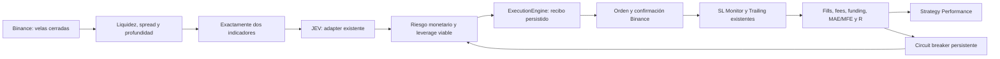

# Reestructuración del motor de Aterum — informe

**Resultado: ninguna estrategia aprobada.** No se demuestra expectancy positiva robusta. La validación cuantitativa permanece rechazada. El usuario autorizó después su activación manual en Delcon; ver [DEPLOYED.md](DEPLOYED.md). Esta activación no convierte el resultado histórico en una aprobación.

Reporte reproducible: [results.json](results.json). Identificador: `7f47a216ad619daa47b7f559b79d708a4a0d638e5d2417ca5ceaeafea4560bae`.

## Arquitectura anterior

Workflow n8n → Risk Guard (cuenta, breaker, capacidad) → contexto macro BTC/ETH/Fear & Greed → Opportunity Discovery → scoring EMA 8/21/50 + RSI14 + VWAP + volumen relativo + 4h + ATR + funding + liquidez + open interest + macro/intelligence → aprendizaje/ranking → JEV, preflight y quality gates → Position Sizer con multiplicadores → ExecutionEngine → Binance → SL Monitor / Trailing Manager → MySQL / Dashboard / Telegram.

El motor ejecutable y la reconciliación estaban separados correctamente de las opiniones de estrategia. La lógica de entrada, en cambio, mezclaba puntuaciones técnicas, ajustes históricos y multiplicadores de riesgo. La política anterior de leverage tenía bandas de confianza más topes por RSI, ATR, score, macro, tendencia y capacidad.

Fuentes inspeccionadas: `services/opportunity_engine.js`, `services/jev*.js`, `bot-control/workflows/code/*`, `position-guard/{execution-engine,guard,portfolio-allocation,binance}.js`, rutas/GUI, tablas de operaciones, decisiones y ejecuciones. Las pruebas previas pasaban: 46/46 suites.

## Arquitectura nueva

`Strategy Mode` separa explícitamente la ruta nueva de la de rollback. La ruta nueva no ejecuta Risk Guard macro, scoring legacy, Learning, Deterministic Entry Gate ni los multiplicadores del Position Sizer antiguo.

JEV conserva su proveedor/adapter y contrato de opciones validadas. Recibe las dos señales, velas, volatilidad contextual, tendencia superior, exposición, correlación descriptiva, margen, costes y rendimiento reciente. Puede elegir LONG, SHORT o NO_TRADE, SL/TP estructurales, régimen y leverage 1–10 entre proyecciones viables. La confianza se registra, pero no se convierte en riesgo adicional sin evidencia.

El tamaño usa distancia al stop más comisiones, slippage y reserva de funding. El leverage cambia el margen; no multiplica el presupuesto de pérdida. El único escritor vuelve a verificar configuración, recibo, cantidad, stop, target, riesgo, reconciliación y Binance antes de persistir una apertura. Un bloqueo de nuevas entradas no bloquea la protección/cierre de posiciones existentes.

## Datos, costes y metodología

- 62 conjuntos, 159,176 velas descargadas de Binance USD-M con funding histórico, checksum y caché local.
- Investigación: BTC, ETH, BNB, SOL, XRP, DOGE, LINK y AVAX; 1h y 4h; 2025-10-01 a 2026-10-01 UTC. La elección previa de activos líquidos evita seleccionar por beneficio, pero no elimina sesgo de supervivencia.
- Comparación: los 46 símbolos de las operaciones archivadas, mismo periodo, capital de 1.000 USDT, comisiones, slippage, funding y límites de riesgo.
- Fee asumida: 0,1% por lado (reserva conservadora heredada del proyecto, **no** tarifa personalizada verificada). Slippage: 5 bps por lado. Sensibilidad: fees ×1,5 y slippage ×2.
- Entrada en la apertura posterior a una vela completa de latencia. Si stop y TP se tocan en la misma vela, prevalece stop; los gaps se llenan adversamente. Funding de débito del intervalo de salida se reserva; créditos de orden temporal incierto se excluyen.
- Capital compartido entre símbolos, máximo tres posiciones, riesgo 0,5% por trade, riesgo agregado máximo 2%, presupuesto de margen 90%, breaker a 15% DD o 10 pérdidas. Son límites de investigación, no parámetros de rentabilidad demostrada.
- DD con equity marcada al cierre de vela, fees de salida estimadas y funding transcurrido. Sharpe/Sortino sobre rendimientos diarios incluyendo días sin operaciones, anualizados con √365. No se reconstruye el DD intrabar ni liquidación real del libro.
- Métricas por LONG/SHORT, símbolo, timeframe, régimen, mes, combinación, confianza y leverage. PF utiliza ganancias/pérdidas **netas**; gross profit/loss y fees se muestran separados.

Documentación primaria: [Klines / funding de Binance USD-M](https://developers.binance.com/en/docs/catalog/core-trading-derivatives-trading-usd-s-m-futures/api/rest-api/market-data).

## Indicadores y selección

Se evaluaron EMA, Supertrend, ADX, MACD, RSI, Stochastic RSI, ATR, Bollinger, VWAP y RVOL: 37 parejas × 2 timeframes = **74 configuraciones iniciales**. Se excluyen parejas de la misma categoría salvo EMA + ADX. ATR + RVOL se registra, pero al carecer de dirección produce NO_TRADE y nunca puede ganar por tener cero operaciones.

Parámetros base simples: EMA 8/21, Supertrend ATR14 ×3, ADX14 ≥25 con dirección DI, MACD12/26/9, RSI14 con zonas 45/55, Stoch RSI14 con zonas 40/60, ATR14 frente a promedio previo, Bollinger20 ×2, VWAP móvil20 y RVOL20 ≥1,2. ATR contextual no añade una tercera señal de entrada.

En TRAIN, las cinco mejores parejas con muestra suficiente se exploran con escalas 0,8 / 1 / 1,2 y seis modos de gestión: fijo, BE, parcial 50% a 1R + BE, trailing, lock y el planner existente. La escala varía periodos y proyecciones ATR; no se buscan umbrales decimales finos. Direcciones se habilitan/excluyen usando TRAIN. VALIDATION nomina; OOS no optimiza. El JSON conserva variantes, vecinos y pruebas de plateau.

**Combinación seleccionada: ninguna.** Candidato sólo diagnóstico: **ADX + BOLLINGER**, 4h, escala 0.8, dirección SHORT, gestión existing. ADX11 ≥25, Bollinger16 ×2, ATR contextual11; stop tras swing de 10 velas y ≥1,2 ATR, target por estructura de hasta 40 velas o proyección 2,4 ATR. No son parámetros aprobados para producción.

## TRAIN, VALIDATION, OOS y walk-forward

- TRAIN: 2025-10-01T00:00:00Z → 2026-05-08T00:00:00Z.
- VALIDATION: 2026-05-08T00:00:00Z → 2026-07-20T00:00:00Z.
- OOS: 2026-07-20T00:00:00Z → 2026-10-01T00:00:00Z.
- No se arrastran posiciones a través de los límites. Las ventanas previas sólo calientan indicadores.

| Periodo / modelo | Trades | Neto USDT | PF neto | Expectancy USDT | Máx. DD | Sharpe | Sortino |
|---|---:|---:|---:|---:|---:|---:|---:|
| TRAIN · candidato diagnóstico | 124 | 22.83 | 1.20 | 0.18 | 3.43% | 0.69 | 1.08 |
| VALIDATION | 54 | -3.14 | 0.94 | -0.06 | 3.11% | -0.24 | -0.33 |
| OOS | 29 | -30.61 | 0.34 | -1.06 | 3.60% | -3.44 | -4.28 |

El beneficio en TRAIN no supera las pruebas completas de estabilidad. VALIDATION y OOS son negativos. **Cuatro folds walk-forward: ninguno produjo una configuración admisible en su entrenamiento; quedan en NO_TRADE.** No se llama rentable a una curva plana sin operaciones. El stress de costes OOS dio -35.18 USDT.

Durante la validación del código se corrigieron el ranking de muestras vacías, la contabilidad del funding intrabar y los límites diarios de rendimientos. Se volvió a ejecutar el análisis tras esas correcciones. El holdout histórico ya está observado: futuras búsquedas necesitan otro periodo intacto. No hay promoción automática.

## Monte Carlo

1.000 permutaciones reproducibles de los 29 trades OOS del candidato rechazado; seed 20261003; riesgo simulado 0,5% por trade.

- DD esperado: 3.59%.
- DD percentil 95: 4.01%.
- Peor DD simulado: 4.55%.
- Probabilidad simulada de ≥10 pérdidas seguidas: 0.10%.
- Equity final p05/mediana/p95: 966.77 / 966.77 / 966.77 USDT.

La equity terminal es prácticamente idéntica porque permutar una serie con capitalización fraccional conserva su producto. Cambian los drawdowns y las rachas. Esta simulación no inventa pérdidas nuevas ni demuestra independencia o rentabilidad; tampoco autoriza subir el riesgo.

## OLD vs NEW

**Comparación de replay controlado, no reproducción integral del motor viejo ni ensayo en vivo de JEV.** OLD usa entradas y niveles archivados; NEW genera señales técnicas del candidato rechazado. Ambos comparten los activos, intervalo 2026-08-15T08:00:00Z → 2026-10-02T12:00:00Z, grid 4h, costes, capital y restricciones.

| Periodo / modelo | Trades | Neto USDT | PF neto | Expectancy USDT | Máx. DD | Sharpe | Sortino |
|---|---:|---:|---:|---:|---:|---:|---:|
| OLD · entradas archivadas | 27 | -41.40 | 0.44 | -1.53 | 4.24% | -4.13 | -4.35 |
| NEW · candidato técnico rechazado | 38 | -33.61 | 0.56 | -0.88 | 3.50% | -4.09 | -5.16 |

No están disponibles todos los prompts históricos, estados de aprendizaje, vetos, spreads y fills contrafactuales del motor anterior. El periodo de comparación solapa con selección/OOS. Esta tabla no demuestra que el sistema nuevo completo supere al anterior. Conservamos la ruta vieja para rollback hasta poder efectuar una comparación completa válida.

## Baseline real y JEV

52 cierres locales: PnL registrado −14,35558 USDT, inicialmente sin desglose de costes. La auditoría read-only por orden de entrada, fills y funding permite atribuir **47/52** cierres: **-15.28 USDT netos**, fees 2.45, funding 0.16, PF 0.53. Los otros 5 carecen de una orden de entrada atribuible y quedan pendientes. El total auditado no debe extrapolarse a toda la cuenta.

Dos errores de atribución corregidos: el timestamp MySQL puede ser posterior al fill de entrada, y la cantidad solicitada puede ser distinta de la ejecutada por redondeo Binance. Se usa evidencia de la orden y cantidad confirmada. También se incluye el milisegundo final de cierres almacenados con precisión de segundos.

Se reportan buckets de confianza 50–60, 60–70, 70–80, 80–90 y 90+, y leverage observado. Calibración: **INSUFFICIENT_OR_NONPREDICTIVE**. No hay tamaño de muestra ni validación cronológica suficiente para elegir umbrales de confianza, ni inferir que 7x causa mejores resultados que 2x. La plantilla nueva admite 1–10x sólo por viabilidad de riesgo/margen; no utiliza los viejos multiplicadores de confianza.

## Integración, observabilidad y límites pendientes

- Nueva página autenticada `/strategy-performance`, enlazada desde el GUI; API autenticada `/api/strategy/performance`. Diferencia investigación, cierres auditados nuevos y baseline antiguo. Tablas de indicadores, LONG/SHORT, confianza, leverage, splits, replay y Monte Carlo.
- Tablas aditivas `strategy_events` y `strategy_breaker`. Decisiones y universo tienen motivos explícitos. Feedback idempotente por trade, costes desconocidos quedan pendientes; no se registran como cero.
- Alertas de entrada sólo tras confirmación y persistencia Binance: dos indicadores, confianza, entry, SL, TP, leverage, capital a riesgo y R. Cierre incorpora bruto, fees, funding, neto, R y motivo cuando están auditados.
- Trailing conserva el planner existente, margen ATR, BE neto, time locks y mejora monotónica del stop. Otros modos se prueban como ablaciones; la promoción rechaza una gestión que aún no tenga integración operativa validada.
- Protección persistente de entradas por DD, racha, falta de JEV/API, datos inválidos, divergencia y fallo de ejecución. Los recibos no habilitan rutas que eviten el único escritor. El reset es explícito, auditado y exige reconciliación.
- MAE/MFE se estiman con velas interiores de 1m cuando la ventana cabe en 1.000 velas; son cobertura parcial, no extremos por tick. Ventanas largas o datos ausentes quedan N/D. Falta recoger excursiones continuas para resolver esa limitación.
- No se han probado órdenes reales nuevas, latencia medida ni ejecución de JEV fuera de muestra. La comparación integral OLD/NEW sigue pendiente. Tampoco se eliminó definitivamente el código legacy: ninguna estrategia cumplió el criterio para sustituirlo.
- La fuente de fees de investigación es conservadora; el ejecutor consulta las fees reales y brackets. Universo histórico sin delistings exhaustivos y libro histórico incompleto: promoción bloqueada también por esos límites.

## Archivos y pruebas

Nuevos módulos: `services/strategy/{indicators,risk,metrics,backtest,trailing,policy,jev_policy,engine,store,feedback,correlation,calibration}.js`; configuración `config/strategy-v2.json`; scripts reproducibles en `scripts/strategy/`; ruta `routes/strategy.js`; página `views/strategy.js`; tests `tests/strategy_{core,integration}.test.js`.

Integraciones modificadas: `services/{jev,jev_execution}.js`, `position-guard/{execution-engine,guard}.js`, `trade.js`, `views/ui_shared.js`, `scripts/preview-gui.js`, `docker-compose.yml`, `.env.example`, `package.json`, workflow principal, sus snippets de sizing/alerta y cuatro nodos de routing. Se ajusta la expectativa del número de nodos en `tests/workflow_redesign.test.js`.

Se preservaron cambios locales preexistentes en mensajes de Telegram, `routes/jev.js`, `routes/learning.js`, `services/telegram_reasons.js` y pruebas de notificaciones. No se atribuyen a esta reestructuración. El diff inicial y workflow previo están preservados en `.local/strategy-v2/`.

Validaciones: [VALIDATION.md](VALIDATION.md). Comandos operativos: [DEPLOYMENT.md](DEPLOYMENT.md). La prueba del GUI utiliza el reporte real y mocks de transporte; no modifica la instancia activa.
