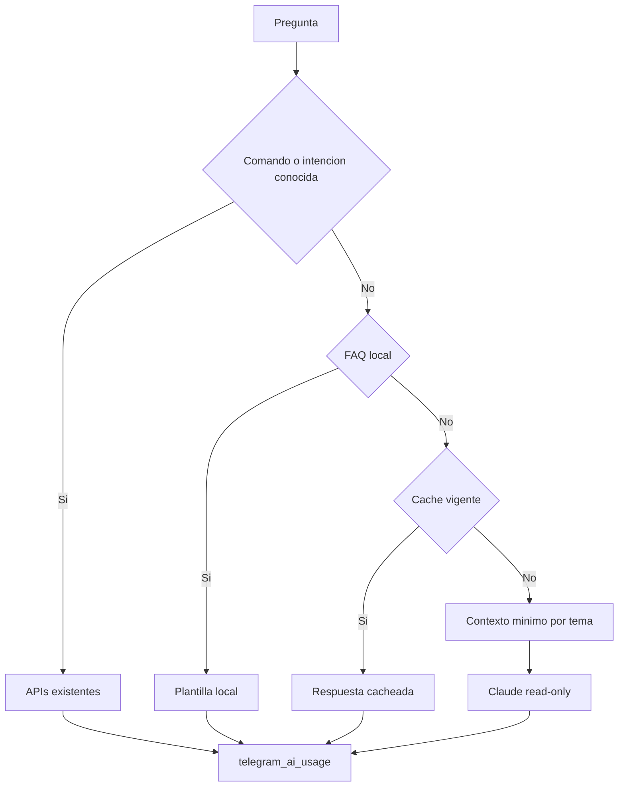

# Copiloto IA local-first

## Objetivo

Telegram Control resuelve consultas operativas con el menor coste posible y conserva trazabilidad cuantitativa. La jerarquia es obligatoria:

1. Comandos e intenciones conocidas: APIs existentes, sin Claude.
2. Conceptos frecuentes: base local en `telegram-control/knowledge.js`, sin Claude.
3. Razonamiento transversal: Claude recibe un contexto minimo, resumido y read-only.

Las preguntas repetidas se sirven desde `telegram_ai_cache` durante `TELEGRAM_AI_CACHE_TTL_SECONDS`. `/ai` consulta `telegram_ai_usage` y muestra rutas, latencia y tokens evitados estimados.

## Flujo

## Variables

| Variable | Uso | Default |
| --- | --- | --- |
| `TELEGRAM_CLAUDE_MODEL` | Modelo del nivel 3 | `claude-haiku-4-5-20251001` |
| `TELEGRAM_AI_CACHE_TTL_SECONDS` | TTL de preguntas identicas | `300` |
| `TELEGRAM_AI_MAX_INPUT_CHARS` | Limite del contexto compacto | `3000` |
| `TELEGRAM_AI_MAX_TOKENS` | Limite de salida | `400` |

`TELEGRAM_ANTHROPIC_API_KEY` aísla la credencial del Copiloto y tiene precedencia sobre `ANTHROPIC_API_KEY`.

## Limites

- Claude no recibe secretos, imagenes, binarios ni trazas completas.
- Los arrays se limitan y las respuestas se compactan antes de enviarse.
- Si una evidencia no existe, la respuesta debe indicar `N/D`.
- El Copiloto no dispone de herramientas para cambiar trading, Research, Learning o n8n.
