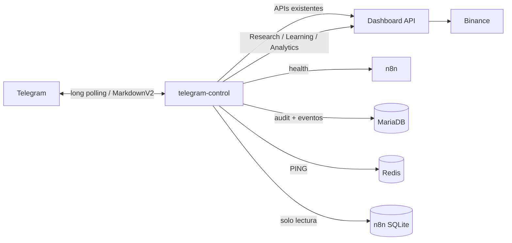

# Aterum Telegram Control

## Decision Knowledge

- `/trade 50`: decisión completa por ID.
- `/timeline 50`: secuencia persistida de una decisión.
- `/why BTCUSDT`: última decisión del símbolo.
- `/evidence BTCUSDT`: IDs de evidencia relacionados.
- `/changes`: impacto y estado de cambios persistidos.

Estos comandos consultan exclusivamente `/api/knowledge/*`. No llaman Claude ni OpenAI y muestran evidencia ausente como tal.

## Copiloto conversacional

Además de los comandos operativos, el bot acepta `/ask pregunta`, texto libre en chat privado, respuestas a un mensaje del bot y `@Delcon8n_bot pregunta` dentro del grupo. El orden de resolución es comando, FAQ local, caché y Claude.

Comandos de orientación:

- `/start`: entrada y límites del Copiloto.
- `/help`: categorías interactivas.
- `/guide`: recorrido por seis pasos.
- `/tutorial`: ejemplos reproducibles.
- `/menu`: navegación principal.
- `/new`: última sección real de `bot-control/CHANGELOG.md`.
- `/ai`: uso local/Claude, caché, latencia y ahorro estimado.
- `/context`: contexto Intelligence que antes ocupaba `/ai`.

Las tablas `telegram_ai_usage` y `telegram_ai_cache` pertenecen exclusivamente al sidecar. No participan en decisiones del bot.

Fecha: 2026-06-28

## Alcance

`telegram-control` convierte el bot existente `@Delcon8n_bot` en un centro de operaciones multiusuario. No ejecuta operaciones de trading, no reconstruye Learning y no modifica Research ni workflows.

## Arquitectura



Los doce nodos Telegram existentes de n8n continúan siendo responsables de notificaciones de trading. El nuevo servicio no los modifica ni los sustituye.

## Menú

- Estado
- Balance
- Performance
- Posiciones
- Research
- Learning
- Noticias
- AI
- Sistema
- Logs
- Historial
- Cambios

Todos están disponibles también como comandos. El grupo acepta `/status`, `/why BTCUSDT`, `/why@Delcon8n_bot BTCUSDT` y `@Delcon8n_bot status`.

## Modelo de permisos

| Rol | Capacidades |
|---|---|
| `viewer` | Estado, balance, posiciones, performance, Research, Learning, health, logs, noticias, AI, `/why`, `/history`, `/changes` |
| `moderator` | Todo viewer más `/simulate`, `/scan`, `/rebuild-report` |
| `admin` | Todo moderator más `/users`, `/role`, `/enable`, `/disable` |

Todo miembro nuevo del grupo autorizado se registra automáticamente como `viewer`. Los administradores configurados se siembran como `admin`. Un usuario deshabilitado permanece auditado pero no puede ejecutar comandos.

## Explainable AI y evidencia

`/why SYMBOL` cruza el trade persistido con la decisión Learning más cercana y muestra score, factores Research/Learning, visión, macro, ATR, volumen, 4H, threshold y razón. Los campos no almacenados se muestran como `N/D`; nunca se reemplazan por contexto actual.

El botón **Ver Evidencia** consulta recomendaciones, Recommendation Review, post-trade, reglas Learning y último reporte Anthropic. `/history SYMBOL` reconstruye cierres y decisiones asociadas. `/changes` usa el ledger existente de Learning Changes.

## Operaciones moderator

- `/simulate`: consulta `/api/simulator/report` sin `force`; no ejecuta workflows ni órdenes.
- `/scan`: lee `scan_events`; no dispara Market Scanner.
- `/rebuild-report`: recompone una vista desde Research/Learning existentes; no genera ni persiste un reporte Anthropic.

## Seguridad

- Whitelist por grupo y RBAC persistido por usuario.
- El destino autorizado es el supergrupo ya usado por los workflows.
- Long polling evita exponer un webhook adicional.
- El socket Docker no está montado.
- n8n SQLite se monta read-only.
- `/simulator` consulta metadatos y no ejecuta simulaciones.
- Cada solicitud queda en `telegram_audit`.

## Auditoría

`telegram_audit` registra `update_id`, usuario, rol, grupo, `chat_id`, comando, fecha, respuesta, duración, resultado, endpoints consultados, errores e IP cuando exista. `update_id` es único para impedir duplicados tras reinicios.

`telegram_users` conserva identidad, rol, habilitación y timestamps.

## Agregar comandos

1. Confirmar primero si la información ya existe en una API.
2. Agregar la composición en `telegram-control/commands.js`.
3. Registrar el comando y, si corresponde, el botón en `telegram-control/telegram.js`.
4. Añadirlo a `telegram-control/self-test.js`.
5. Asignar explícitamente el rol mínimo y añadir pruebas positivas/negativas.

## Operación

```bash
sudo docker compose up -d telegram_control
sudo docker compose ps telegram_control
sudo docker logs --tail 100 home-telegram_control-1
sudo docker compose run --rm --no-deps telegram_control node telegram-control/self-test.js
```

## Siguiente fase propuesta, no implementada

- Confirmación doble y expiración para cualquier acción mutable.
- Webhooks n8n firmados para pausar/reanudar, nunca llamadas directas a Binance.
- Suscripciones configurables de alertas y umbrales.
- Paginación de posiciones, eventos e informes históricos.
- Registro de aprobación, motivo y resultado para toda acción administrativa.
- Botón de emergencia separado, protegido y con confirmación fuera de Telegram.
