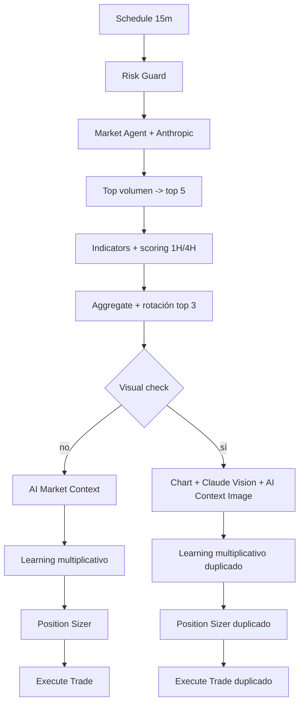
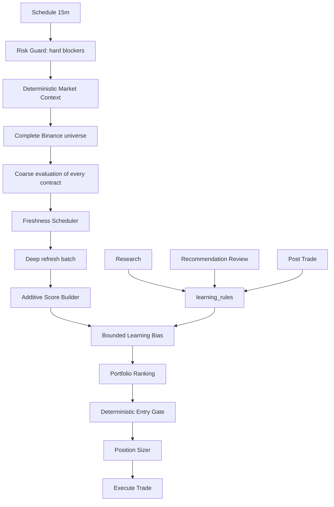

# Decision Pipeline V2

## Resultado ejecutivo

El pipeline anterior mezclaba selección, contexto, modelos generativos, filtros binarios y Learning multiplicativo. En una muestra de 120 ejecuciones recientes sólo 39 llegaron a evaluar un símbolo; 12 tuvieron score técnico de 80 o más y 11 fueron rechazadas. El rechazo de setups altos fue 91.7% y sólo se exploraron 11 símbolos.

V2 separa cuatro responsabilidades:

1. Risk Guard aplica únicamente bloqueos duros de capital y disponibilidad.
2. Opportunity Engine descubre el universo, refresca símbolos por frescura y calcula un score aditivo.
3. Portfolio Selector ordena candidatos y aplica límites explícitos.
4. Learning aporta un sesgo aditivo de máximo ocho puntos, sin multiplicaciones ocultas.

Research, Recommendation Review y Post Trade siguen alimentando `learning_rules`. No llaman directamente a Binance ni tienen un veto generativo sobre entradas.

## Arquitectura anterior



## Pipeline anterior por etapa

| Etapa | Propósito histórico | Entradas | Salidas | Confianza | Influencia real |
| --- | --- | --- | --- | --- | --- |
| Scanner | Encontrar contratos líquidos | ticker 24H, OI, 24 velas | cinco símbolos | Sin calibración | Excluía todo salvo top volumen y luego top cinco |
| Research | Interpretar rendimiento | trades, rechazos, post-trade | reportes/recomendaciones | Declarativa | Entraba otra vez vía factores de reglas |
| Market Regime | Clasificar tendencia/volatilidad | indicadores y Anthropic | regime/bias | No probabilística | Ajustaba score y luego sizing |
| Macro | Medir BTC/ETH/F&G | BTC, ETH, F&G, noticias | bias, `long_ok`, `short_ok`, size | Heurística + texto IA | Podía vetar dirección y también penalizar score |
| Learning | Adaptar por histórico | símbolo, setup, sesión, régimen, score | factor compuesto | Muestra por regla | Multiplicaba hasta nueve factores y podía bloquear |
| Review | Validar recomendaciones | reviews e impacto | `review_factor` | Basada en muestra | Volvía a multiplicarse con otras dimensiones |
| Score Builder | Medir setup | EMA, RSI, volumen, VWAP, funding, OI, 4H | score 0-100 | Determinista | 4H ya modificaba el score aquí |
| Risk | Proteger capital | balance, PnL, CB, posiciones, sesión | pass/halt | Dura | Mezclaba capital, horarios y Learning Capital |
| Entry Gate | Aprobar/rechazar | score, macro, IA, imagen, Learning | booleano | No calibrada | Repetía 4H, Macro y volatilidad |
| Execution | Abrir/proteger | posición dimensionada | market + STOP + TP | Verificación Binance | Correctamente aislada; se conserva |

## Matemática anterior

```text
S1H = trend + RSI + volume + VWAP + funding + OI
S4H = clamp(S1H + tf4h_adjust - extreme_rsi_adjust)
SAI = clamp(S4H + anthropic_adjust + intelligence_adjust
             - second_tf4h_penalty - late_trend_penalty)
threshold = macro/4H threshold (62..80) + open_position_penalty (0..8)
Slearning = SAI * product(research, symbol, setup, session, regime,
                          score_band, combination, review, post_trade)
```

El producto final estaba limitado a `0.70..1.30`, pero un score 80 podía caer a 56. La misma evidencia aparecía en `setup`, `regime`, `combination` y `post_trade`.

## Matriz de contradicciones

| Contradicción | Evidencia | Corrección V2 |
| --- | --- | --- |
| Score 80+ termina rechazado | 11 de 12 en 120 ejecuciones | Learning aditivo acotado; sin veto generativo |
| Score 100 termina en 75 y se rechaza | MU/SNDK/DRAM en ejecuciones reales | El score es suma visible; no existe `confidence_adjustment` IA |
| 4H se aplica dos veces | Scoring ajustaba hasta -20 y AI restaba otros 10 | `trend_4h` aparece una sola vez |
| Macro veta y penaliza | `long_ok=false`, threshold 80 y ajuste de inteligencia | Macro aporta máximo +/-8; Risk no usa dirección macro |
| Volatilidad se evalúa en cuatro sitios | Scanner, AI Context, Vision y Learning regime | Calidad ATR existe sólo en Score Builder; Learning usa evidencia histórica acotada |
| Selección no usa el mejor score | Rotación forzada entre top tres | Orden descendente estable; rank 1 es la única selección |
| Símbolo rechazado recibe cooldown adicional | Build Skip imponía 60 minutos | Sólo el scheduler de frescura decide reevaluación |
| Rechazo se persistía dos veces | Dos llamadas `/db/rejection` en un nodo | Una única escritura de rechazo y una de scan |
| Filtros anidados acumulan penalizaciones | setup + regime + combination | Se elige sólo una dimensión estructural |
| Regla rentable penaliza | TRENDING: expectancy positiva y PF > 1 con weight < 1 | Profitability guard neutraliza esa penalización |

## Arquitectura V2



## Score V2

```text
technical_score = clamp(sum(visible contributions), 0, 100)
final_score = clamp(technical_score + learning_delta, 0, 100)
decision_margin = final_score - 65
```

| Componente | Rango | Responsabilidad exclusiva |
| --- | ---: | --- |
| Base común | +15 | Escala |
| Trend 1H | 0..+25 | EMA 8/21/50 1H |
| RSI momentum | -10..+15 | Momento y extremo |
| VWAP structure | -5..+10 | Ubicación estructural |
| Volume quality | -8..+10 | Confirmación de volumen |
| Trend 4H | -15/0/+15 | Confirmación multi-timeframe |
| ATR quality | -8..+5 | Calidad de volatilidad |
| Funding | -3..+5 | Crowding contrarian |
| Liquidity | +1..+5 | Volumen quote 24H |
| Open interest | -5..+5 | Profundidad nocional |
| Macro | -8..+8 | BTC/ETH/F&G determinista |
| Intelligence | -5..+5 | Noticias/sesión sólo con confianza media/alta |
| Learning | -8..+8 total | Evidencia histórica no solapada |

Cada respuesta contiene componente, valor, evidencia, valor observado y máximo. El threshold de entrada es fijo en 65; ocupación de portfolio reduce capacidad, no cambia el threshold.

## Learning V2

Para cada regla seleccionada:

```text
effective_weight = weight * research_factor * review_factor
delta_i = clamp(25 * (effective_weight - 1), -3, +3)
learning_delta = clamp(sum(delta_i), -8, +8)
```

- `combination`, `setup` y `regime` son jerárquicas; sólo contribuye la más específica con muestra suficiente.
- `symbol`, `session` y `score_band` pueden aportar una vez cada una.
- si expectancy >= 0 y Profit Factor >= 1, una regla no puede penalizar;
- un bloqueo aprendido exige acción `block`, evidencia alta y al menos 20 cierres;
- Capital Guard se aplica en Risk Guard y el Entry Gate registra `delegatedTo=risk_guard`, sin bloquear dos veces.

## Exploración y scheduling

Cada ciclo descarga `exchangeInfo` y ticker 24H. Los 524 contratos perpetuos crypto/USDT se evalúan en la etapa coarse. La elegibilidad profunda exige volumen quote de al menos USD 5M, cambio absoluto menor a 45% y OI nocional mínimo de USD 1M.

El scheduler refresca 32 contratos por ciclo:

- hot: cada 30 minutos;
- warm: cada 60 minutos;
- cold: cada 180 minutos;
- nunca analizados: prioridad de cobertura;
- un símbolo no vuelve a entrar antes de `next_scan_at`.

La separación coarse/deep evita unas 2,000 llamadas REST por ciclo. Un ciclo usa dos descargas globales y hasta 128 consultas profundas, con concurrencia ocho.

## Portfolio selection y Risk

Los candidatos se ordenan por `final_score`, luego `coarse_score`. Sólo rank 1 puede avanzar en cada ciclo para evitar carreras de órdenes. La capacidad máxima sigue siendo tres posiciones.

Bloqueos explícitos:

- exchange, Risk API o Capital Guard no disponible;
- circuit breaker;
- límites diario, semanal, drawdown o racha global;
- máximo de posiciones;
- posición ya abierta;
- cooldown operativo vigente;
- correlación de exposición con una posición abierta mayor a 0.80, ajustada por LONG/SHORT;
- OI insuficiente o datos de mercado incompletos.

Cada bloqueo entrega `code`, `current`, `minimum/maximum` y `margin/exceeded` cuando aplica. Macro, Research, Review, ATR, RSI y Learning no son controles de capital.

## Componentes retirados

- `Indicators and Scoring` y `Aggregate Best Setup`: integrados en Opportunity Engine.
- `AI Market Context` y `AI Market Context Image`: retirados del entry.
- `DETECTOR DE RSI EXTREMO`, `Need Visual Check`, chart command y Claude visual: retirados del entry.
- rama duplicada `Position Sizer1` / `Execute Trade1` y alertas de imagen: retirada.
- fallback generativo por símbolo: retirado.
- rotación forzada top tres y macro cooldown estático: retirados.

Se conservan los cálculos de `Position Sizer`, SL Monitor y Trailing Manager, pero no su antigua autoridad de escritura. `Execute Trade` genera `OPEN_POSITION`; Position Guard/Execution Engine crea y verifica MARKET, SL y TP. `Monitor SL Global`, persistencia y Telegram sólo continúan tras `VERIFIED`. Los cambios posteriores de SL y los cierres siguen el mismo contrato.

## Persistencia y APIs

- `market_scan_cycles`: cobertura y duración por ciclo.
- `market_symbol_state`: frescura por símbolo.
- `market_opportunities`: ranking, contribuciones, blockers y selección.
- `POST /api/opportunities/scan`: ejecuta discovery determinista.
- `GET /api/opportunities/latest`: ranking persistido.
- `GET /api/opportunities/coverage`: cobertura/frescura.

## Impacto medido

| Métrica | Antes | V2 controlado |
| --- | ---: | ---: |
| Universo coarse | top por volumen | 524 contratos |
| Elegibles profundos | 17-40 variables | 179-181 |
| Deep scan por ciclo | máximo 5 | 32 |
| Símbolos repetidos en tres ciclos | frecuentes | 0 |
| Cobertura acumulada tras tres ciclos | N/D | 53% |
| Duración de ciclo | 20-40 s observados | 1.9-2.0 s |
| Llamadas generativas de entry | 1-2 por ciclo/fallback | 0 |
| Rechazos duplicados por evento | hasta 2 | 1 |

En las últimas 24 horas el sistema anterior exploró 17 símbolos. V2 puede cubrir aproximadamente 181 elegibles en seis ciclos, unos 90 minutos: 10.6 veces más cobertura. En el tercer ciclo, 10 de 32 candidatos quedaron por encima del threshold sin blockers.

Esto aumenta la disponibilidad esperada de oportunidades de una selección esporádica a hasta una oportunidad válida por ciclo cuando exista capacidad. No implica ni promete mayor rentabilidad o un número fijo de operaciones: las posiciones abiertas, correlación, Capital Guard y condiciones técnicas siguen limitando ejecución.

## Validación

1. Tests unitarios de universo, frescura, score, correlación y Learning cap.
2. Tres ciclos reales con datos públicos de Binance y workflow inactivo.
3. Comparación de batches: 96 análisis, cero símbolos repetidos.
4. Entry Gate dry-run: ranking `97.64`, gate `97.64`, margen `+32.64`.
5. Position Sizer offline: qty, SL, TP, margen y riesgo calculados sin enviar órdenes durante esa prueba.
6. Verificación SQL de ciclos, oportunidades y reglas.
7. Verificación de nodos/credenciales antes de publicar.

### Validación operativa de ejecución

Durante las importaciones y reinicios de despliegue se produjeron tres ejecuciones operativas no planificadas de la versión activa anterior: POLUSDT, GALAUSDT y MEMEUSDT. Todas cerraron por el mecanismo de emergencia y no dejaron posición ni orden abierta. El resultado agregado fue `-0.1560794 USDT` realizado y `0.76645984 USDT` de comisión.

En POLUSDT, Binance aceptó el STOP con `closePosition=true` a las `02:04:39.376Z`, pero la consulta inmediata de su `algoId` respondió temporalmente `-2013`. El nodo interpretó esa lectura prematura como fallo y ejecutó correctamente el cierre de emergencia; el STOP quedó `EXPIRED` 580 ms después. GALAUSDT mostró el mismo patrón. Las tres ejecuciones pertenecen a la versión `db00f693-836c-4e86-a6e0-57cccbfecb5d`, no a la versión final.

La causa del falso fallo fue consistencia eventual entre `POST /fapi/v1/algoOrder` y `GET /fapi/v1/algoOrder`. La versión final reintenta cinco veces, conserva el cuerpo de error de Binance y cancela un algo no verificable antes del cierre de emergencia. Una prueba controlada observó `-2013` a 250 ms y estado `NEW` a 750 ms.

La ejecución `95165` sobre 1000PEPEUSDT mostró otro caso: Binance rechazó el contrato `closePosition` antes de crear el algo. El cierre de emergencia dejó la cuenta sin exposición, con `-0.00858749 USDT` realizado y `0.20166455 USDT` de comisión. El contrato de cantidad explícita fue probado sobre el mismo símbolo y aceptó tanto STOP como TP; por eso la versión final intenta `closePosition` y, si el POST falla, usa la cantidad confirmada de Binance.

La ejecución real `94927` de V2 terminó `success` y abrió SOLUSDT como oportunidad rank 1: score técnico `83`, Learning `-3.708`, score final `79.29`, threshold `65`. MySQL creó el trade `52` y el Dashboard confirmó SL/TP. Una ejecución intermedia posterior abrió METUSDT y MySQL creó el trade `53`.

La protección final de ambas posiciones usa pares nativos `STOP_MARKET` / `TAKE_PROFIT_MARKET` con `closePosition=true`: SOLUSDT `73.09 / 77.55` y METUSDT `0.1673 / 0.1844`. No quedan LIMIT de cierre que compitan por cantidad. Después del último arranque se realizaron 65 controles durante 152 segundos; las cuatro órdenes permanecieron `NEW` sin restauraciones.

El workflow publicado final es `bbfc049d-14ee-46f4-8a2f-414f93c58c57`, con 26 nodos y sin ramas antiguas.

La evaluación inicial debe revisarse después de 20 trades cerrados. Hasta entonces no deben elevarse pesos ni threshold basándose únicamente en frecuencia.
