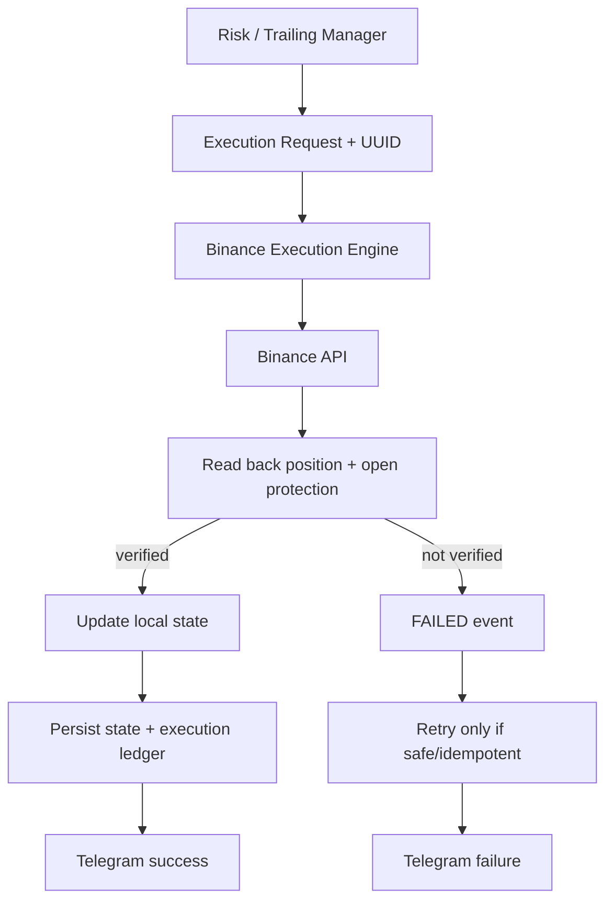

# Pipeline de ejecución verificada

Fecha: 2026-06-30 UTC

## Invariante

Binance es la fuente de verdad. Una respuesta `200` al crear una orden no equivale a ejecución confirmada. Ningún estado local ni mensaje Telegram de éxito puede adelantarse a la lectura posterior de la posición y sus órdenes protectoras.

## Contrato de ejecución

`POST http://position_guard:3091/executions` requiere bearer token y acepta:

- `OPEN_POSITION`
- `MOVE_STOP_LOSS`
- `MOVE_TAKE_PROFIT`
- `PARTIAL_TAKE_PROFIT`
- `TRAILING_STOP`
- `CLOSE_POSITION`

La respuesta terminal contiene `executionId`, `exchangeOrderId`, `exchangeResponse`, `verificationResult`, `timestamp` y `finalStatus`. Sólo `finalStatus=VERIFIED` junto con `verificationResult.verified=true` habilita el siguiente paso local.

Cada request usa UUID y client order ID determinista. Un timeout puede dejar el resultado de Binance desconocido; antes de reintentar, el motor consulta ese client ID para evitar una segunda orden.

## Reemplazo de SL/TP

El orden es deliberadamente conservador:

1. Leer posición y protección actual.
2. Crear la nueva orden protectora.
3. Releer Binance hasta encontrar exactamente la orden solicitada.
4. Cancelar únicamente las órdenes del mismo tipo que quedaron obsoletas.
5. Releer posición y protección.
6. Confirmar que la nueva existe y las anteriores ya no.
7. Persistir el nuevo nivel local.

La protección anterior nunca se cancela antes de que la nueva exista en Binance.

## Reducciones y cierres

TP parcial se confirma cuando la cantidad Binance disminuye por la cantidad solicitada. Un cierre se confirma únicamente cuando la posición deja de existir; después se cancelan las protecciones residuales y se verifica que tampoco sigan abiertas.

Si la protección inicial de una apertura no puede verificarse, el motor cierra la posición, verifica el rollback y termina `FAILED`. No se crea estado local de trade ni Telegram de apertura.

## Fallos

Ante rechazo o verificación fallida:

- no se avanza estado local;
- no se genera mensaje de éxito;
- se persisten `EXECUTION_ATTEMPT_FAILED` y `EXECUTION_FAILED`;
- sólo se reintentan red, timeout, rate limit o 5xx con client ID idempotente;
- se envía una notificación de fallo desde el motor o, si éste no fue alcanzable, desde n8n.

## Sincronización

Position Guard compara cada cinco segundos MySQL contra posición, órdenes regulares y Algo orders de Binance. Compara entry, qty, leverage, SL y TP. La deriva se corrige siempre Binance → local y se audita en `position_guard_events`.

Una posición Binance sin trade local se adopta después de una ventana de 30 segundos. Esa ventana evita competir con una ejecución en curso. Si un trade local ya no existe en Binance, se buscan fills y tipo de salida; si el historial no está disponible, igualmente se cierra localmente como `SYNC` con exit/PnL marcados como estimados. La ausencia de fills no puede mantener una posición fantasma abierta.
